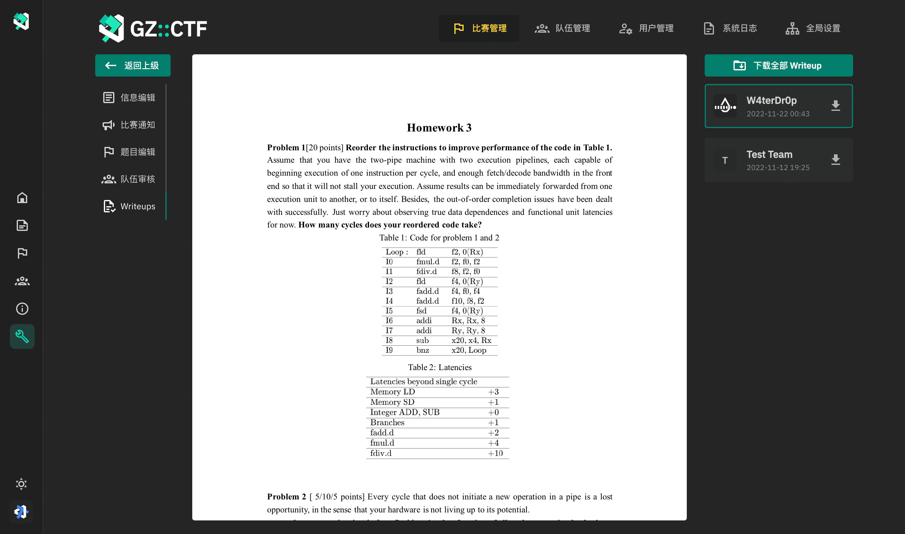
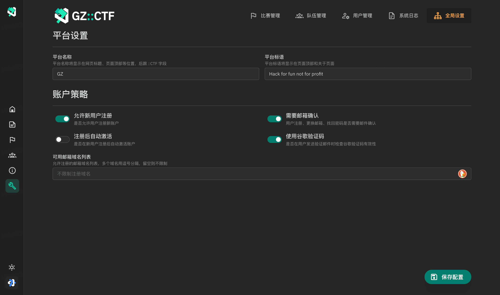

<picture>
  <source media="(prefers-color-scheme: dark)" srcset="assets/banner.dark.svg">
  
</picture>

# GZ::CTF

GZ::CTF は ASP.NET Core を基づいたオープンソース CTF プラットフォーム。

> [!IMPORTANT]
> **お使いの前にドキュメントを読むことは極めてお勧めします：[https://docs.ctf.gzti.me/](https://docs.ctf.gzti.me/)**

> [!WARNING]
> 2024/01/01 より，`develop` ブランチから構築されたイメージのデータベーススキーマに破壊的変更が行われたため、従来のデータベースとの交換性はありません。従来のバージョンを引き続き使いたかった場合は `v0.17` を使ってください。
>
> 新しい機能の開発期間で `develop` イメージを生産環境にデプロイすることはお勧めしません。データ損失が発生する恐れがあります。

## 機能 🛠️

- 高度カスタマイズ可能な挑戦問題を作れる 

  - 問題種類：静的アタッチメント、動的アタッチメント、静的コンテイナー、動的コンテイナー
    - 静的アタッチメント：アタッチメントは共有され、追加されたフラッグのどれも提出可能となります。
    - 動的アタッチメント：チーム数に応じたフラッグやアタッチメントが少なくとも必要となり、チームに応じてアタッチメントやフラッグが配布されます。
    - 静的コンテイナー：コンテナーのテンプレートは共有され、フラッグは発行されず、追加されたフラッグのどれも提出可能となります。
    - 動的コンテイナー：フラッグは自動的に生成され、コンテナ環境変数を通じて配布され、各チームのフラッグは一意です。

  - 動的スコアリング

    - スコアリングカーヴ：

      $$f(S, r, d, x) = \left \lfloor S \times \left[r  + ( 1- r) \times \exp\left( \dfrac{1 - x}{d} \right) \right] \right \rfloor $$

      このうち、 $S$ はオリジナルスコア、 $r$ は最低スコア率、 $d$ は難易度係数、 $x$ は提出数です。 最初の 3 つのパラメータは、ほとんどの動的なスコア要件を達成するためにカスタマイズできます。

    - ボーナス：
      プラットフォームは、ファーストブラッド、セカンドブラッドとサードブラッドに対して、それぞれポイントの 5%、3%、および 1% をボーナスとして与えます。

  - 問題はコンテスト中に有効または無効にすることができ、複数回公開もできます。
  - 動的フラッグ問題に対する不正検出機能、オプションのフラッグテンプレートとリートフラッグ機能

- **グループ チーム** スコアタイムライン、グループ順位表
- **Docker または K8S** に基づいた動的なコンテナの分散、管理、および複数のポート マッピング方法のサポート 
- SignalR に基づいた**リアルタイム**コンテスト通知、コンテストイベントとフラッグ送信とログの監視
- SMTPメール検証機能、Google ReCaptchav3による悪意のある登録防止
- ユーザーのブロックおよび権限管理
- オプションのチームレビュー、招待コード、登録メール制限
- プラットフォーム内での Writeup の収集、レビューとバッチダウンロード
- スコアボードのダウンロードおよびエクスポート、すべての提出記録もダウンロードできます
- コンテスト中の審判監視、提出とメインイベントのログ
- 問題に対するトラフィック **TCP over WebSocket プロキシ転送**、トラフィック キャプチャの設定ができます
- Redis ベースのクラスター キャッシュ、PGSQL をデータベースとして使用
- グローバル設定でプラットフォームタイトルと他の情報を設定可能
- その他...

## Demo 🗿

## i18n について 🌐

多言語対応についてはいま取り込んでいます、詳細や翻訳を提供するなどは [#156](https://github.com/GZTimeWalker/GZCTF/issues/156) まで参照してください。

## 貢献者 👋

## 大会事例 🏆

以下は GZCTF を使った CTF 大会事例の一部です。主催者たちの信頼、サポートと大切なフィードバックが GZCTF の継続的改善の原動力となっております。

- **清华大学网络安全技术挑战赛 THUCTF 2022**
- **浙江大学 ZJUCTF 2022/2023**
- **东南大学虎踞龙蟠杯网络安全挑战赛 SUSCTF 2022/2023**
- **甘肃政法大学 DIDCTF 2022/2023**
- **山东科技大学第一届网络安全实践大赛 woodpecker**
- **西北工业大学 NPUCTF 2022**
- **SkyNICO 网络空间安全三校联赛 (厦门理工学院、福建师范大学、齐鲁工业大学)**
- **湖南警察学院网络安全攻防大赛**
- **中山大学第一届信息安全新手赛 [W4terCTF 2023](https://github.com/W4terDr0p/W4terCTF-2023)**
- **同济大学第五届网络安全竞赛 TongjiCTF 2023**
- **重庆工商大学第一届网络安全竞赛 CTBUCTF 2023**
- **西北工业大学第一届安全实验技能竞赛 NPUCTF 2023**
- **浙江师范大学行知学院第一届网络安全新手赛 XZCTF 2023**
- **哈尔滨工程大学贡橙杯新生赛 ORGCTF 2023**
- **"山河"网络安全技能挑战赛 SHCTF 2023**
- **天津科技大学 2023 年大学生创客训练营网络安全组选拔**
- **湖南衡阳师范学院玄天网安实验室招新赛 HYNUCTF 2023**
- **南阳师范学院招新赛 NYNUCTF S4**
- **商丘师范学院首届网络安全新生挑战赛**
- **苏州市职业大学 2023 年冬季新生赛 [SVUCTF-WINTER-2023](https://github.com/SVUCTF/SVUCTF-WINTER-2023)**

_順番は順位との関係はありません。追加ための PR は大歓迎。_

## 特別感謝 ❤️‍🔥

THUCTF 2022 の主催者である NanoApe によるスポンサーシップと、Alibaba Cloud パブリックネットワークでのストレステストのおかげで、数千の同時実行と 3 分間の 134 万のリクエストのプレッシャーの下で GZCTF 単一マシンインスタンス (16c90g) のサービスの安定性を検証することができました。ここで心から感謝申し上げます。 

## Stars ✨

