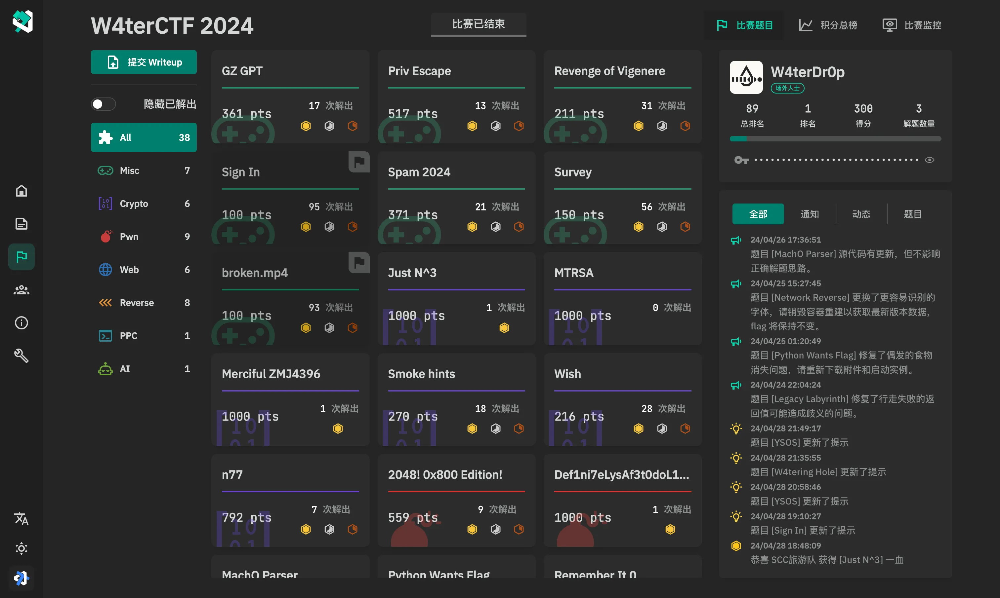
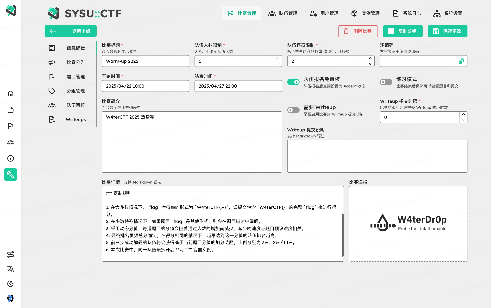
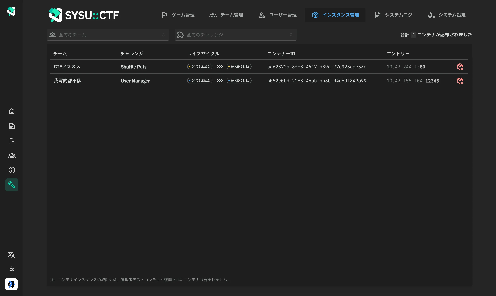

<picture>
  <source media="(prefers-color-scheme: dark)" srcset="assets/banner.dark.svg">
  
</picture>

# GZ::CTF

[English](./README.md), [简体中文](./README.zh.md), [日本語](./README.ja.md)

GZ::CTF は ASP.NET Core を基づいたオープンソース CTF プラットフォーム。

> [!IMPORTANT]
>
> **お使いの前にドキュメントを読むことは極めてお勧めします：[https://gzctf.gzti.me/](https://gzctf.gzti.me/ja)**

> [!WARNING]
>
> **アップグレードと移行に関する注意事項:**
>
> 1. プラットフォームをアップグレードするには、最新のイメージを取得して再起動するだけで、データベースの移行が自動的に行われます。
> 2. 一般的に、**ダウングレード** 操作はサポートされていません。時間スパンが大きいバージョンのアップグレードは、データの非互換性を引き起こす可能性があるため、**データのバックアップを取ることをお勧めします**。
> 3. アップグレード後、新しい構成項目やファイル構造の変更がある場合があります。公式ドキュメントやコミュニティに相談することをお勧めします。
> 4. 別のブランチプロジェクトに移行する場合は、データベース構造が変更されていないかどうかに注意してください。**変更後のデータベースは元のバージョンにロールバックできません**。
> 5. コミュニティと公式メンテナーは、データの損失、データの非互換性、その他の問題について責任を負いません。ブランチプロジェクトの問題については、対応するプロジェクトメンテナーに連絡してください。

## 機能 🛠️

- 高度カスタマイズ可能なチャレンジを作れる

  - チャレンジ種類：静的アタッチメント、動的アタッチメント、静的コンテイナー、動的コンテイナー

    - 静的アタッチメント：アタッチメントは共有され、追加されたフラッグのどれも提出可能となります。
    - 動的アタッチメント：チーム数に応じたフラッグやアタッチメントが少なくとも必要となり、チームに応じてアタッチメントやフラッグが配布されます。
    - 静的コンテイナー：コンテナーのテンプレートは共有され、フラッグは発行されず、追加されたフラッグのどれも提出可能となります。
    - 動的コンテイナー：フラッグは自動的に生成され、コンテナ環境変数を通じて配布され、各チームのフラッグは一意です。

  - 動的スコアリング

    - スコアリングカーヴ：

      $$f(S, r, d, x) = \left \lfloor S \times \left[r  + ( 1- r) \times \exp\left( \dfrac{1 - x}{d} \right) \right] \right \rfloor $$

      このうち、 $S$ はオリジナルスコア、 $r$ は最低スコア率、 $d$ は難易度係数、 $x$ は提出数です。 最初の 3 つのパラメータは、ほとんどの動的なスコア要件を達成するためにカスタマイズできます。

    - ボーナス：
      プラットフォームは、ファーストブラッド、セカンドブラッドとサードブラッドに対して、それぞれポイントの 5%、3%、および 1% をボーナスとして与えます。

  - チャレンジはゲーム中に有効または無効にすることができ、複数回公開もできます。
  - 動的フラッグのチャレンジに対する不正検出機能、オプションのフラッグテンプレートとリートフラッグ機能

- **組織ごとにグループされたチーム**のスコアタイムライン、組織順位表
- **Docker または K8S** に基づいた動的なコンテナの分散、管理、および複数のポート マッピング方法のサポート
- SignalR に基づいた**リアルタイム**ゲーム通知、ゲームイベントとフラッグ送信とログの監視
- SMTP メール検証機能、Cloudflare Turnstile による悪意のある登録防止
- ユーザーのブロックおよび権限管理
- オプションのチームレビュー、招待コード、登録メール制限
- プラットフォーム内での記事の収集、レビューとバッチダウンロード
- ランキングのダウンロードおよびエクスポート、すべての提出もダウンロードできます
- ゲーム中の審判監視、提出とメインイベントのログ
- チャレンジに対するトラフィック **TCP over WebSocket プロキシ転送**、トラフィック キャプチャの設定ができます
- Redis ベースのクラスター キャッシュ、PGSQL をデータベースとして使用
- ローカルディスクおよび**オブジェクトストレージ（MinIO、S3 など）**に基づくストレージバックエンド
- グローバル設定でプラットフォームタイトルと他の情報を設定可能
- **ダークモード**、多言語、カスタムテーマのサポート
- **ウェブサイトのフッター**、**ファビコン**、SEO 向け**HTML の説明**のカスタマイズ可能
- マトリクスと分散トレーシングのサポート
- その他...

## i18n について 🌐

現在、このプラットフォームは複数の言語をサポートしており、翻訳の進捗状況は以下の通りです。

### コミュニティによる翻訳

- 英語 (en-US)：完全対応、デフォルト言語
- 簡体字中国語 (zh-CN)：完全対応
- 繁体字中国語 (zh-TW)：完全対応
- 日本語 (ja-JP)：完全対応、[Steve](http://github.com/hez2010) による翻訳
- インドネシア語 (id-ID)：完全対応、[Rio](https://github.com/riodrwn) による翻訳
- 韓国語 (ko-KR)：完全対応、 [Sy2n0](https://github.com/Sy2n0), [kimjw0427](https://github.com/kimjw0427), [LittleDev0617](https://github.com/LittleDev0617), [Jungwoong Kim](https://github.com/jungwngkim), [blluv](https://github.com/blluv) による翻訳
- ロシア語 (ru-RU)：完全対応、 [FazaN](https://github.com/CyberFazaN) による翻訳
- ベトナム語 (vi-VN)：完全対応、[Ethical Hacker Club](https://github.com/FPTU-Ethical-Hackers-Club) による翻訳

### 機械および AI による翻訳

- ドイツ語 (de-DE)
- フランス語 (fr-FR)
- スペイン語 (es-ES)

これらの翻訳は完全ではないため、改善のために皆さんの協力が必要です。

翻訳に貢献することに興味がある方は、[Crowdin プロジェクト](https://crowdin.com/project/gzctf) を参照してください。

## Demo 🗿

## 貢献者 👋

## 大会事例 🏆

以下は GZCTF を使った CTF 大会事例の一部です。主催者たちの信頼、サポートと大切なフィードバックが GZCTF の継続的改善の原動力となっております。

### 国際イベント

- [**San Diego CTF 2024: Organized by University of California, San Diego**](https://ctftime.org/event/2325)
- [**R3CTF 2024: Organized by r3kapig**](https://ctftime.org/event/2273)
- [**TCP1P CTF 2024: Exploring Nusantara's Digital Realm**](https://ctftime.org/event/2256/)

### その他のイベント

- **清華大学ネットワークセキュリティ技術チャレンジ THUCTF 2022**
- **浙江大学 ZJUCTF 2022/2023/2024**
- **東南大学虎踞龍蟠杯ネットワークセキュリティチャレンジ SUSCTF 2022/2023/2024**
- **甘粛政法大学 DIDCTF 2022/2023/2024**
- **山東科技大学第一回ネットワークセキュリティ実践大会 woodpecker**
- **西北工業大学 NPUCTF 2022**
- **SkyNICO ネットワーク空間セキュリティ三校連合大会 (厦門理工学院、福建師範大学、齐鲁工業大学)**
- **湖南警察学院ネットワークセキュリティ攻防大会**
- **中山大学情報セキュリティ新人戦 W4terCTF [2023](https://github.com/W4terDr0p/W4terCTF-2023)/2024**
- **浙江師範大学 ZJNUCTF [2023](https://github.com/A1natas/zjnuctf-school-contest-2023)/[2024](https://github.com/A1natas/zjnuctf-school-contest-2024)**
- **同済大学第五回ネットワークセキュリティ大会 TongjiCTF 2023**
- **同済大学ネットワークセキュリティ大会（新入生コンクール） CatCTF 2023/2024**
- **重慶工商大学第一回ネットワークセキュリティ大会 CTBUCTF 2023**
- **西北工業大学第一回セキュリティ実験技能大会 NPUCTF 2023**
- **浙江師範大学行知学院第一回ネットワークセキュリティ新人戦 XZCTF 2023**
- **ハルビン工程大学貢橙杯新生大会 ORGCTF 2023**
- **"山河"ネットワークセキュリティ技能チャレンジ SHCTF 2023**
- **天津科技大学 2023 年大学生クリエイタートレーニングキャンプネットワークセキュリティグループ選抜**
- **湖南衡陽師範学院玄天ネット安実験室新人戦 HYNUCTF 2023**
- **南陽師範学院新人戦 NYNUCTF S4**
- **商丘師範学院初回ネットワークセキュリティ新人戦**
- **蘇州市職業大学 2023 年冬季新人戦 [SVUCTF-WINTER-2023](https://github.com/SVUCTF/SVUCTF-WINTER-2023)**
- **北京航空航天大学 BUAACTF 2024**
- **曲阜師範大学第 1 回“曲 star”サイバーセキュリティスキルコンテスト**
- **成都理工大学第 4 回、第 5 回情報セキュリティ・コンペティション DinoCTF**
- **重慶郵電大学 RedrockCTF 2024**
- **重慶安全技術職業学院 2024 年「先锋杯」ネットワークセキュリティ技術競技 WAXFCTF**

_順番は順位との関係はありません。追加ための PR は大歓迎。_

## 特別感謝 ❤️‍🔥

THUCTF 2022 の主催者である NanoApe によるスポンサーシップと、Alibaba Cloud パブリックネットワークでのストレステストのおかげで、数千の同時実行と 3 分間の 134 万のリクエストのプレッシャーの下で GZCTF 単一マシンインスタンス (16c90g) のサービスの安定性を検証することができました。ここで心から感謝申し上げます。

## Stars ✨

