<picture>
  <source media="(prefers-color-scheme: dark)" srcset="assets/banner.dark.svg">
  
</picture>

# GZ::CTF

[English](./README.md), [简体中文](./README.zh.md), [日本語](./README.ja.md)

GZ::CTF is an open source CTF platform based on ASP.NET Core.

> [!IMPORTANT]
>
> **To save your effort, please read the documentation carefully before using: [https://gzctf.gzti.me/](https://gzctf.gzti.me/)**

> [!WARNING]
>
> **Upgrade and migration considerations:**
>
> 1. To upgrade the platform, simply pull the latest image and restart, and the database migration will be performed automatically.
> 2. In general, **downgrade** operations are not supported. Upgrading versions with a large time span may result in data incompatibility, so **please make sure to back up your data**.
> 3. After the upgrade, there may be new configuration items and changes in file structure. It is recommended to consult the official documentation or the community.
> 4. If you are migrating to another branch project, please pay attention to whether the database structure has changed. **The database after the change does not support rollback to the original version**.
> 5. The community and the official maintainers are not responsible for data loss, data incompatibility, and other issues. For issues with branch projects, please contact the corresponding project maintainer.

## Features 🛠️

- Create highly customizable challenges

  - Type of challenges: Static Attachment, Dynamic Attachment, Static Container, Dynamic Container

    - Static Attachment: Shared attachments, any configured flag can be accepted.
    - Dynamic Attachment: The number of flags and attachments must be at least the number of teams. Attachments and flags are distributed according to the teams.
    - Static Container: Shared container templates, no dynamic flag is issued, and any configured flag can be submitted.
    - Dynamic Container: Automatically generate and issue flags through container environment variables, and flag of each team is unique.

  - Dynamic Scores

    - Curve of scores:

      $$f(S, r, d, x) = \left \lfloor S \times \left[r  + ( 1- r) \times \exp\left( \dfrac{1 - x}{d} \right) \right] \right \rfloor $$

      Where $S$ is the original score, $r$ is the minimum score ratio, $d$ is the difficulty coefficient, and $x$ is the number of submissions. The first three parameters can be customized to satisfy most of the dynamic score requirements.

    - Bonus for first three solves:
      The platform rewards 5%, 3%, and 1% of the current score for the first three solves respectively.

  - Disable or enable challenges during the competition, and release new challenges at any time.
  - Dynamic flag sharing detection, optional flag template, leet flag

- **Teams** score timeline, scoreboard. Teams can be grouped
- Dynamic container distribution, management, and multiple port mapping methods based on **Docker or K8s**
- **Real-time** competition notification, competition events and flag submission monitoring, and log monitoring based on SignalR
- SMTP email verification, malicious registration protection based on Cloudflare Turnstile
- Ban specific user, three-level user permission management
- Optional team review, invitation code, registration email restriction
- Writeup collection, review, and batch download in the platform
- Download exported scoreboard, export all submission records
- Monitor submissions and major event logs during the competition
- Challenges traffic forwarding based on **TCP over WebSocket proxy**, configurable traffic capture
- Cluster cache based on Redis, database storage backend based on PGSQL
- Storage backend based on local disk and **object storage (MinIO, S3, etc.)**
- Customizable global configuration, platform title, record information
- Support for **dark mode**, multiple languages, and custom themes
- Customizable **website footer**, **website favicon**, and **html description** for SEO
- Support metrics and distributed tracing
- And more...

## About i18n 🌐

Currently, the platform supports multiple languages, and the translation progress is as follows:

### Translated by Community

- English (en-US): Fully supported, **default language**
- Simplified Chinese (zh-CN): Fully supported
- Traditional Chinese (zh-TW): Fully supported
- Japanese (ja-JP): Fully supported, translated by [Steve](https://github.com/hez2010)
- Indonesian (id-ID): Fully supported, translated by [Rio](https://github.com/riodrwn)
- Korean (ko-KR): Fully supported, translated by [Sy2n0](https://github.com/Sy2n0), [kimjw0427](https://github.com/kimjw0427), [LittleDev0617](https://github.com/LittleDev0617), [Jungwoong Kim](https://github.com/jungwngkim) and [blluv](https://github.com/blluv)
- Russian (ru-RU): Fully supported, translated by [FazaN](https://github.com/CyberFazaN)
- Vietnamese (vi-VN): Fully supported, translated by [Ethical Hacker Club](https://github.com/FPTU-Ethical-Hackers-Club)

### Translated by Machine and AI

- German (de-DE)
- French (fr-FR)
- Spanish (es-ES)

These translations are not perfect, and we need your help to improve them.

If you are interested in contributing to the translation, please refer to the [Crowdin project](https://crowdin.com/project/gzctf).

## Demo 🗿

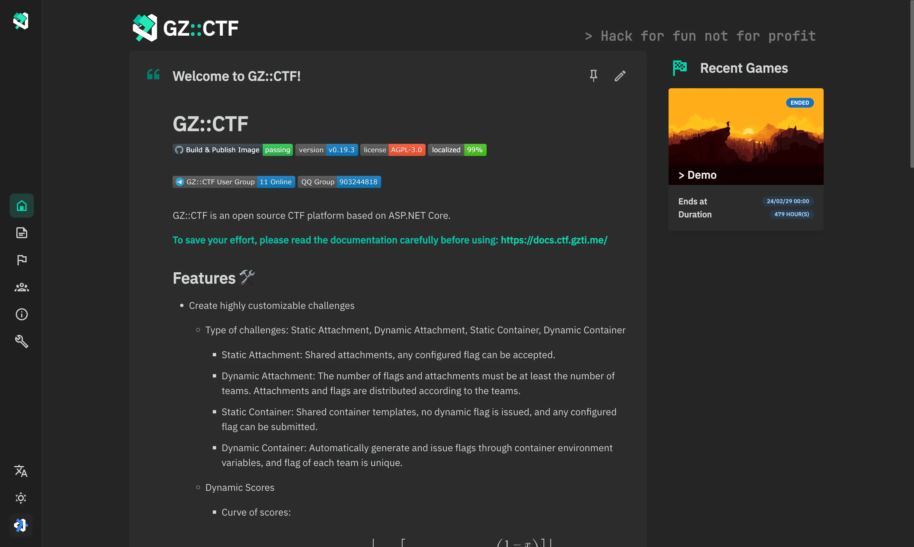
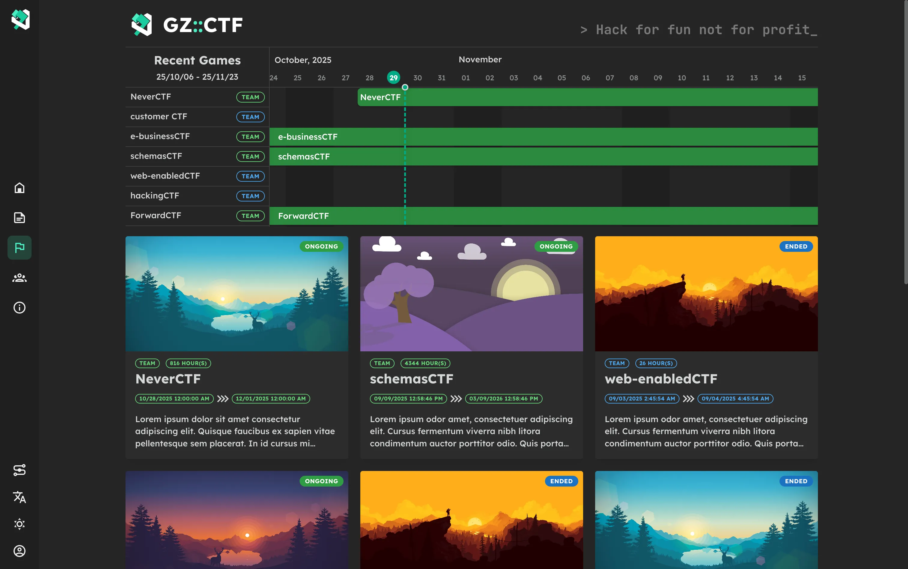
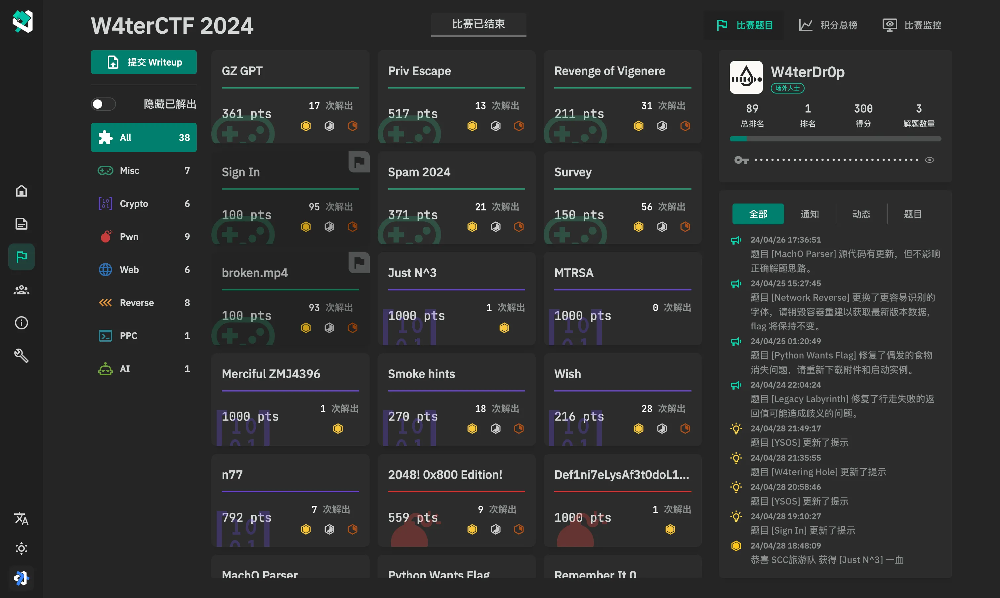
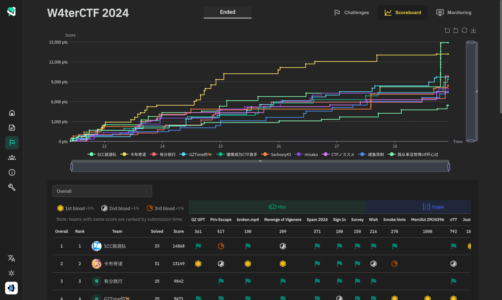
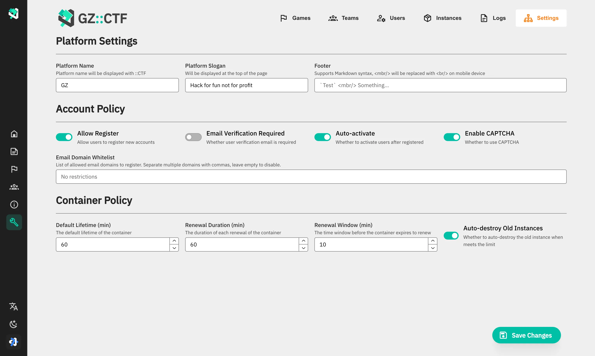
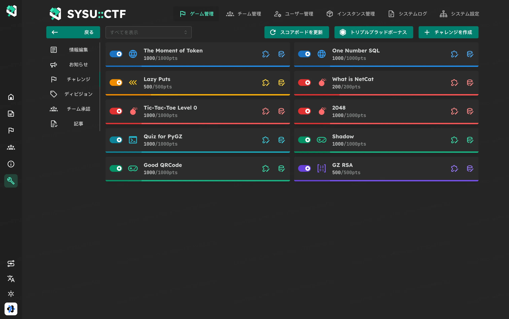
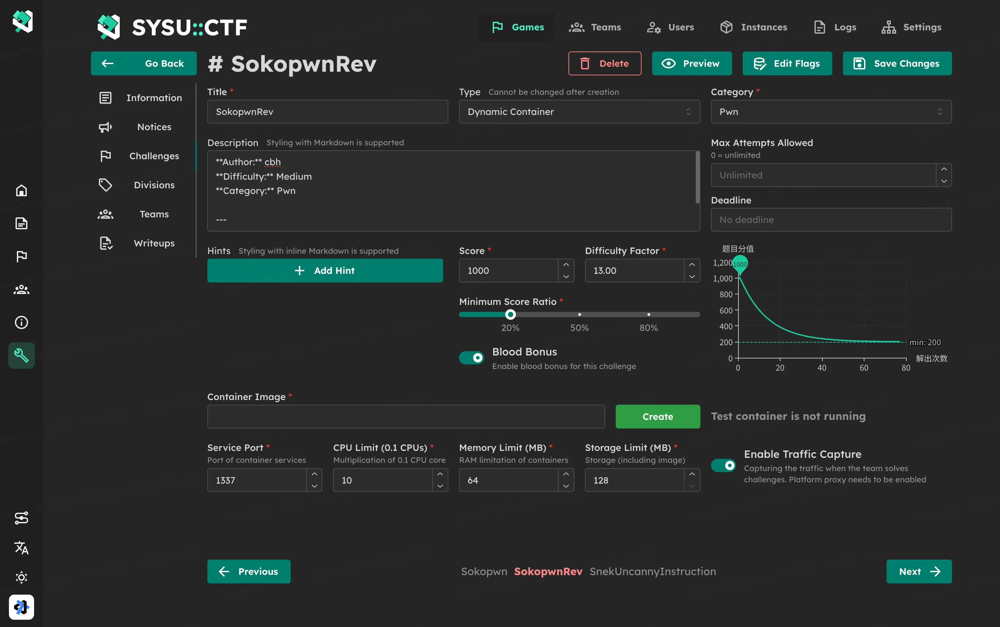
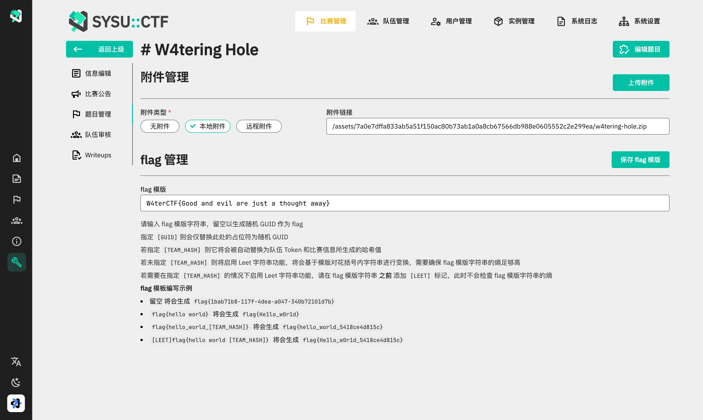
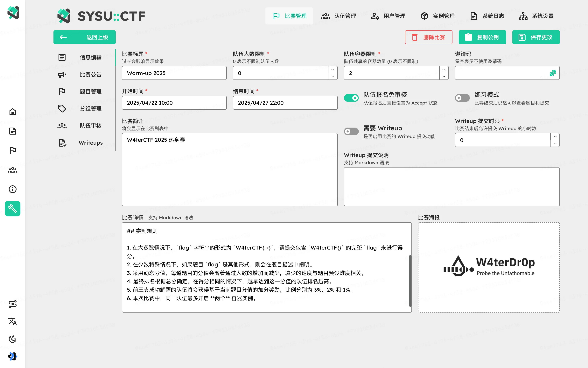
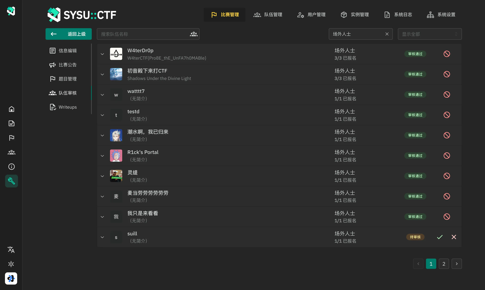
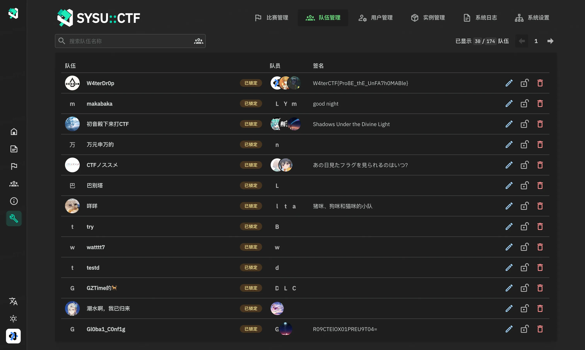
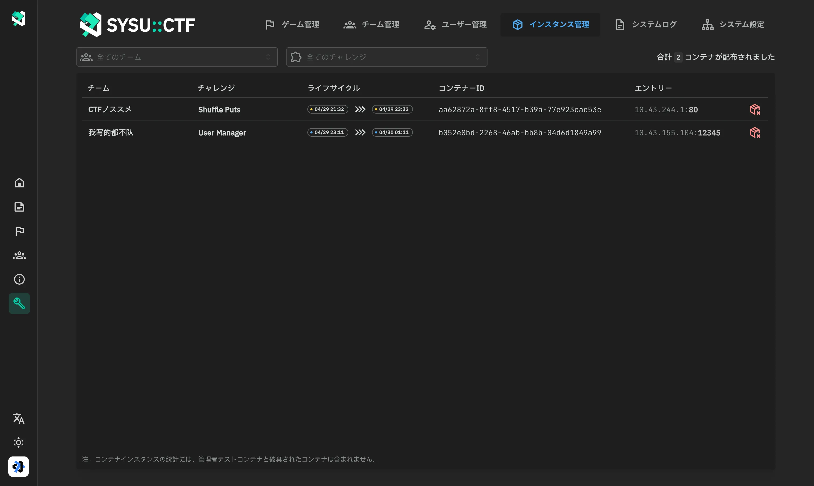
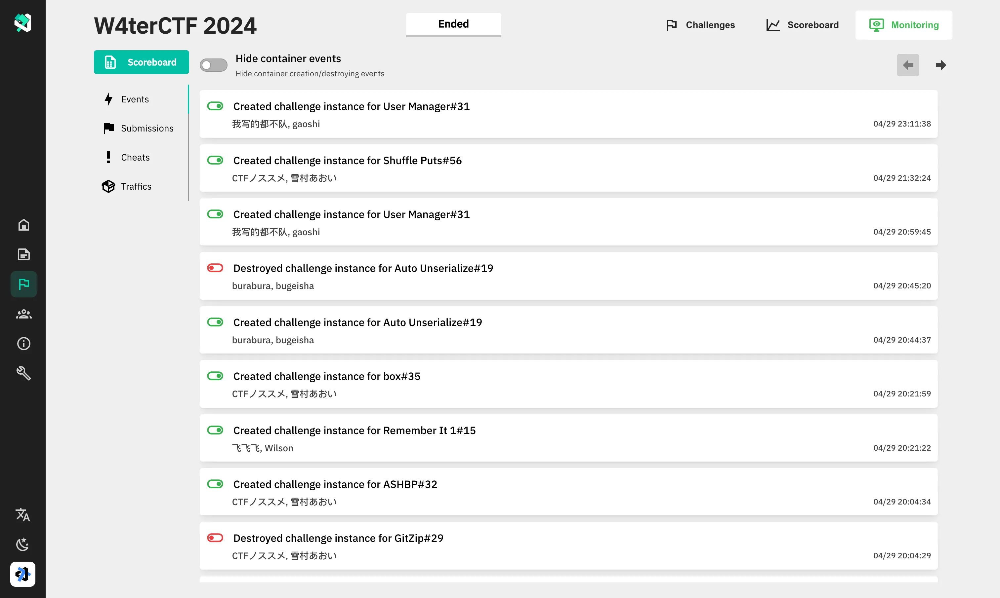
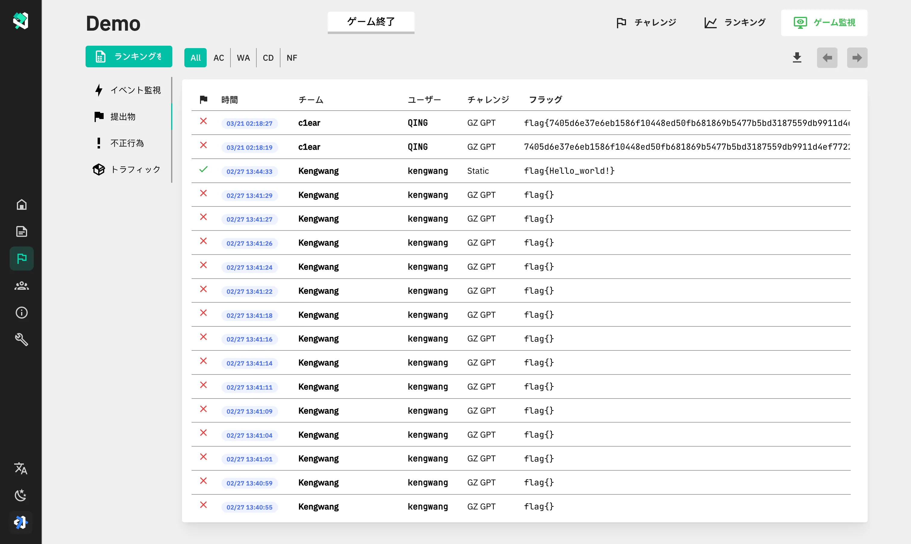

## Contributors 👋

## CTF hosted with GZ::CTF 🏆

Some event organizers have already chosen GZCTF and successfully completed their competitions. Their trust, support, and timely feedback are the primary driving force behind the continuous improvement of GZCTF.

### International Events

- [**San Diego CTF 2024: Organized by University of California, San Diego**](https://ctftime.org/event/2325)
- [**R3CTF 2024: Organized by r3kapig**](https://ctftime.org/event/2273)
- [**TCP1P CTF 2024: Exploring Nusantara's Digital Realm**](https://ctftime.org/event/2256/)

### Other Events

- **THUCTF 2022: Tsinghua University Network Security Technology Challenge**
- **ZJUCTF 2022/2023/2024: Zhejiang University CTF**
- **SUSCTF 2022/2023/2024: Southeast University Tiger Crouching, Dragon Coiling Cup Network Security Challenge**
- **DIDCTF 2022/2023/2024: Gansu Political and Legal University CTF**
- **W4terCTF [2023](https://github.com/W4terDr0p/W4terCTF-2023)/2024: Information Security Novice Competition of Sun Yat-sen University**
- **ZJNUCTF [2023](https://github.com/A1natas/zjnuctf-school-contest-2023)/[2024](https://github.com/A1natas/zjnuctf-school-contest-2024): Zhejiang Normal University CTF**
- **Woodpecker: The First Network Security Practice Competition of Shandong University of Science and Technology**
- **NPUCTF 2022: Northwestern Polytechnical University CTF**
- **SkyNICO Network Space Security Tri-school Competition (Xiamen University of Technology, Fujian Normal University, Qilu University of Technology)**
- **Hunan Police Academy Network Security Attack and Defense Competition**
- **TongjiCTF 2023: The Fifth Network Security Competition of Tongji University**
- **CatCTF 2023/2024: Network Security Competition of Tongji University (Elementary Level)**
- **CTBUCTF 2023: The First Network Security Competition of Chongqing Technology and Business University**
- **NPUCTF 2023 - The First Security Experimental Skills Competition of Northwestern Polytechnical University**
- **XZCTF 2023: The First Network Security Novice Competition of Zhejiang Normal University Xingzhi College**
- **ORGCTF 2023: Gongcheng Cup Freshman Competition of Harbin Engineering University**
- **SHCTF 2023: "Shanhe" Network Security Skills Challenge**
- **Tianjin University of Science and Technology 2023 College Student Maker Training Camp Network Security Group Selection**
- **HYNUCTF 2023: Xuantian Network Security Laboratory Recruitment Competition of Hunan Hengyang Normal University**
- **NYNUCTF S4: Recruitment Competition of Xuantian Network Security Laboratory of Nanyang Normal University**
- **The First Network Security Freshman Challenge of Shangqiu Normal University**
- **SVUCTF-WINTER-2023: Suzhou Vocational University 2023 Winter Freshman Competition**
- **BIEM CTF 2024：Beijing Institute Of Economics And Management - The first BIEM "Xin'an Cup" CTF competition**
- **BUAACTF 2024: Beihang University CTF**
- **The first "Qu STAR" network security skills competition of Qufu Normal University**
- **DinoCTF: The 4th & 5th Information Security Competition of Chengdu University of Technology**
- **RedrockCTF 2024：Information Security Novice Competition of Chongqing University Of Posts And Telecommunications**
- **WAXFCTF 2024：Chongqing Vocational Institute of Safety Technology "Pioneer Cup" Cybersecurity Skills Competition**

_These list is not in any particular order, and PRs are welcome for additions._

## Special Thanks ❤️‍🔥

Thanks to NanoApe, the organizer of THUCTF 2022, for providing sponsorship and conducting Alibaba Cloud public network stress testing. This helped validate the service stability of the GZCTF standalone instance (16c90g) under the pressure of thousands of concurrent requests and 1.34 million requests in three minutes.

## Stars ✨

