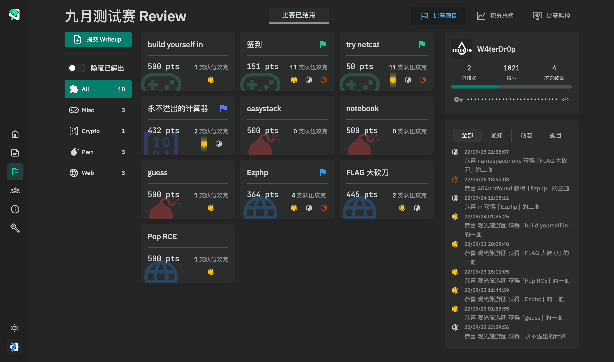
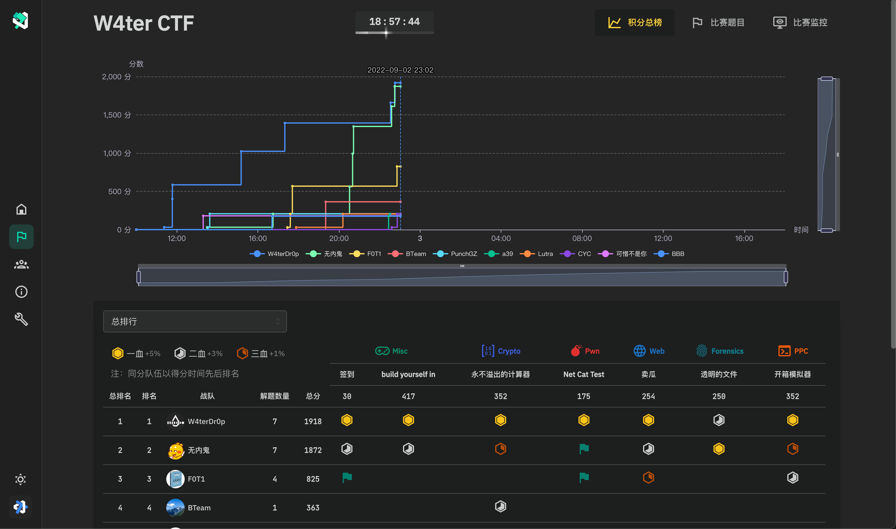
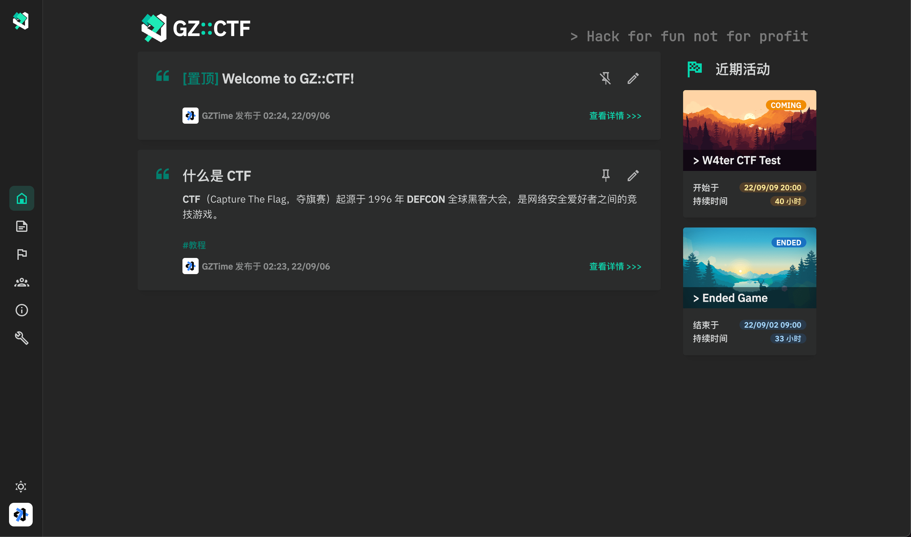
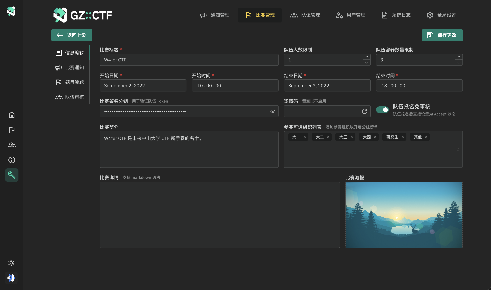
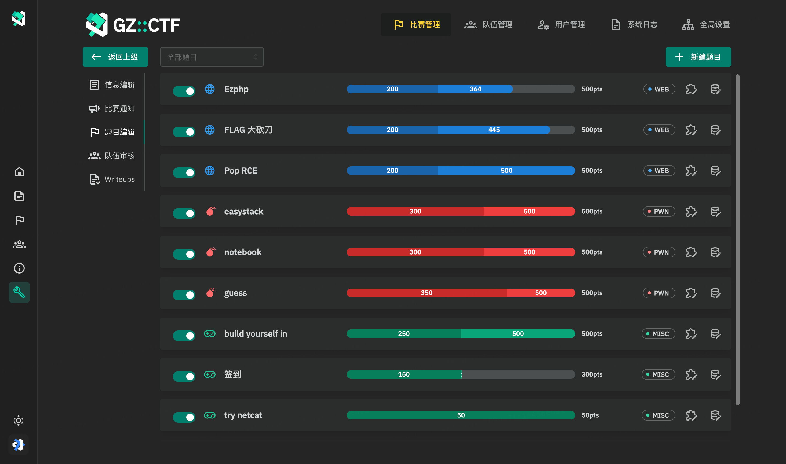
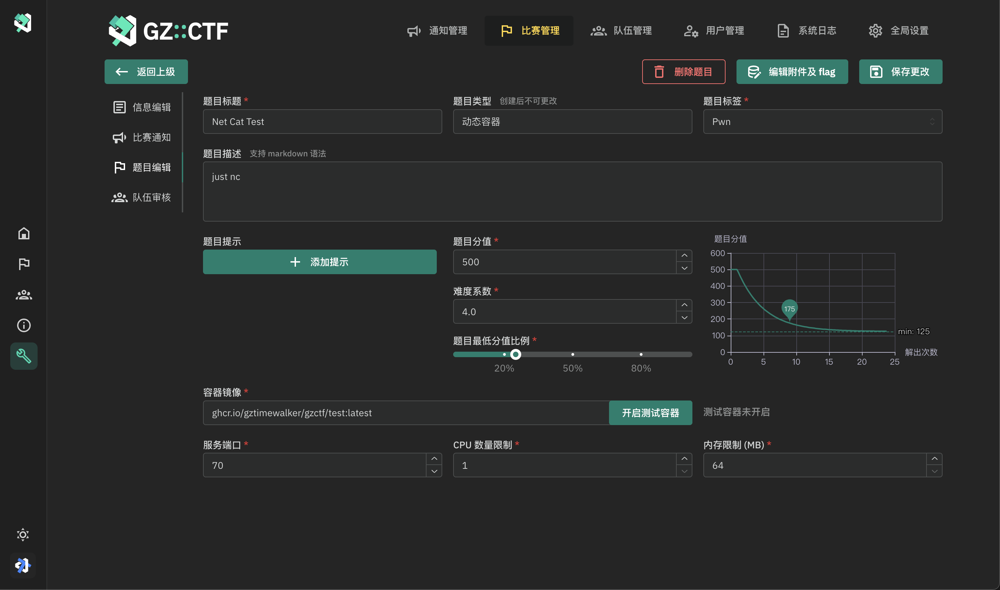
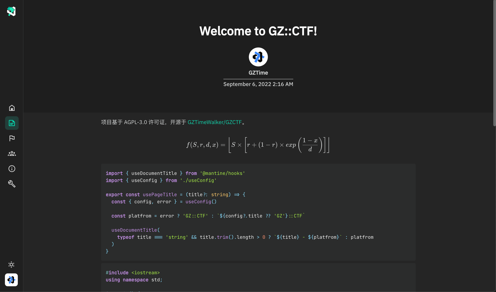

<picture>
  <source media="(prefers-color-scheme: dark)" srcset="assets/banner.dark.svg">
  
</picture>

# GZ::CTF

[](https://github.com/GZTimeWalker/GZCTF/actions/workflows/ci.yml)


[](https://telegram.dog/gzctf)
[](https://deepsource.io/gh/GZTimeWalker/GZCTF/?ref=repository-badge)

GZ::CTF 是一个基于 ASP.NET Core 的开源 CTF 平台。

## 特性

- 创建高度可自定义的题目
  - 题目类型：静态附件、动态附件、静态容器、动态容器
    - 静态附件：共用附件，任意添加的 flag 均可提交。
    - 动态附件：需要至少满足队伍数量的 flag 和附件，附件及 flag 按照队伍进行分发。
    - 静态容器：共用容器模版，不下发 flag，任意添加的 flag 均可提交。
    - 动态容器：自动生成并通过容器环境变量进行 flag 下发，每个队伍 flag 唯一。
  - 动态分值
    - 分值曲线：
        $$f(S, r, d, x) = \left \lfloor S \times \left[r  + ( 1- r) \times exp\left( \dfrac{1 - x}{d} \right) \right] \right \rfloor $$
      其中 $S$ 为原始分值、 $r$ 为最低分值比例、 $d$ 为难度系数、 $x$ 为提交次数。前三个参数可通过自定义实现绝大部分的动态分值需求。
    - 三血奖励：
      平台对一二三血分别奖励 5%、3%、1% 的当前题目分值
  - 比赛进行中可启用新题
  - 动态 flag 中启用作弊检测，可选的 flag 模版，leet flag 功能
- 基于 Docker 或 K8s 的动态容器分发
- 分组队伍得分时间线、分组积分榜
- 基于 signalR 的实时比赛通知、比赛事件和 flag 提交监控及日志监控
- SMTP 注册邮件发送、基于 Google ReCaptchav3 的恶意注册防护
- 用户封禁、用户三级权限管理
- 可选的队伍审核、邀请码、注册邮箱限制
- 实时事件监控、下载积分榜、下载全部提交记录
- 比赛期间裁判监控、提交和主要事件日志
- 应用内全局设置
- 以及更多……

## Demo









## 安装配置

应用已编译打包成 Docker 镜像，可通过以下方式获取：

```bash
docker pull gztime/gzctf:latest
# or
docker pull ghcr.io/gztimewalker/gzctf/gzctf:latest
```

也可使用 `scripts` 目录下的 `docker-compose.yml` 文件进行配置。

题目配置和题目示例请见 [GZCTF-Challenges](https://github.com/GZTimeWalker/GZCTF-Challenges) 仓库。

### `appsettings.json` 配置

当 `ContainerProvider` 为 `Docker` 时：
  - 如需使用本地 docker，请将 Uri 置空，并将 `/var/run/docker.sock` 挂载入容器对应位置
  - 如需使用外部 docker，请将 Uri 指向对应 docker API Server

当 `ContainerProvider` 为 `K8s` 时：
  - 请将集群连接配置放入 `k8sconfig.yaml` 文件中，并将其挂载到 `/app` 目录下

```json
{
  "AllowedHosts": "*",
  "ConnectionStrings": {
    "Database": "Host=db:5432;Database=gzctf;Username=postgres;Password=another_p4sswr0d",
    "RedisCache": "cache:6379,password=some_password" // optional
  },
  "Logging": {
    "LogLevel": {
      "Default": "Information",
      "Microsoft": "Warning",
      "Microsoft.Hosting.Lifetime": "Information"
    }
  },
  "EmailConfig": { // optional
    "SendMailAddress": "a@a.com",
    "UserName": "",
    "Password": "",
    "Smtp": {
      "Host": "localhost",
      "Port": 587
    }
  },
  "XorKey": "Q22yg09A91YWm1GsOf9VIMiw",
  "DisableRateLimit": false,
  "ContainerProvider": {
    "Type": "Docker", // or "Kubernetes"
    "PublicEntry": "ctf.example.com", // or "xxx.xxx.xxx.xxx"
    "DockerConfig": { // optional
        "SwarmMode": false,
        "Uri": "unix:///var/run/docker.sock"
    }
   },
  "RegistryConfig": { // optional
    "UserName": "",
    "Password": "",
    "ServerAddress": ""
  },
  "GoogleRecaptcha": { // optional, recaptcha v3
    "VerifyAPIAddress": "https://www.recaptcha.net/recaptcha/api/siteverify",
    "Sitekey": "",
    "Secretkey": "",
    "RecaptchaThreshold": "0.5"
  }
}
```

### 初始管理员

生产环境中默认不存在管理员权限用户，需要手动更改数据库条目。当管理员注册完成并成功登录后，进入所选数据库表格后执行：

```sql
update "AspNetUsers" set "Role"=3;
```

### 端口暴露范围设置

- Docker 部署：
  - `sudo nano /etc/sysctl.conf`
  - 添加如下内容，指定 `ip_local_port_range`：

    ```
    net.ipv4.ip_local_port_range = 20000 50000
    ```

  - 执行 `sudo sysctl -p` 使配置生效
  - 重启 Docker 服务

- K3s 部署：

  - `sudo nano /etc/systemd/system/k3s.service`
  - 编辑如下设置中的 `ExecStart`，指定`service-node-port-range`

    ```
    ExecStart=/usr/local/bin/k3s \
        server \
        --kube-apiserver-arg service-node-port-range=20000-50000
    ```
  - `sudo systemctl daemon-reload`
  - `sudo systemctl restart k3s`

- K8s 及 Docker Swarm 部署：

  - 笔者尚未尝试，如有成功的朋友欢迎提 PR 补充

### Q&A

- **Q: 题目类型中的“静态容器”指的是全部参赛者共用一个容器吗？**

  不是。静态容器于动态容器相同，每个参赛队伍都有一个独立的容器。

  但是静态容器内的内容是一样的，且不会传递下发动态 flag。只能通过获取硬编码于容器中的一个或多个静态 flag 作为验证指标，也即“静态”的意思。

- **Q: 目前的组队逻辑是怎么样的呢？**

  一名用户可参与多个队伍，每场比赛每个均需要每名队员独立报名，同一个人可以以不同队伍身份同时参与多场比赛，报名时需要选择以哪个队伍进行参赛。

  在报名等待审核和被拒绝时可以撤回报名。审核通过、禁赛时不可撤回报名及更换所属队伍，且队伍将会被锁定。

  在比赛结束后，队伍仍然显示处于锁定状态，若确认没有其他正在进行中的比赛时进行人员变动，队伍将会自动解锁。

- **Q: 平台支持哪些部署形式？**

  平台支持的部署形式有：

    - K8s 集群部署：

      GZCTF、数据库、题目容器均在同一 k8s 集群中，使用命名空间进行隔离

    - Docker + K8s 分离部署：

      GZCTF、数据库在一个 Docker 实例中，并使用远程 k8s 作为题目容器平台

    - Docker 单机部署：

      GZCTF、数据库、题目容器均在同一 Docker 实例中

    - Docker 分离部署：

      GZCTF、数据库在一个 Docker 实例中，并使用远程另一 Docker/Docker Swarm 作为题目容器平台（不推荐）

    - Docker Swarm 集群部署：

      GZCTF、数据库、题目容器均在 Docker Swarm 集群中（不推荐）

- **Q: 关于部署的建议？**

  对于拥有多机集群及其部署需求的用户，建议使用 K3s 作为 K8s 的发行版，其能提供所需的全部功能，且易于安装部署。

  更一般的情况下最方便的部署方式为 Docker + K3s 分离部署，只需要执行 `docker-compose` 即可完成 GZCTF 平台的部署，而 K3s 的部署则只需要执行安装后导出 kubeconfig 挂载给 GZCTF 即可。

  如果需要使用 K3s 集群内部署，需要提供两个 PVC（用于数据库及附件存储）、一个 ConfigMap（用于存储 `appsettings.json`）、一个 Secret（用于存储指向自己集群的 `k8sconfig.yaml`）。你可以按需进行数据库部署及 Redis 部署，如果只运行一个 GZCTF 实例，可以不部署 Redis。

- **Q: GZCTF 集群多实例部署有什么需要注意的？**

  GZCTF 支持多个实例同时运行，但需要提供相同的数据库实例及 Redis 实例（多实例必选）及共享存储（如 NFS）作为 PVC。其中数据库实例和共享存储用于保证数据一致，Redis 实例用于进行后端部分数据的缓存同步、SignalR 的 Scale-Out 广播。

  同时，为了确保 SignalR 基于 websocket 的正常运行，需要在负载均衡器中配置 Sticky Session。

- **Q: 也没有更详细的部署教程？**

  在写了，v1.0.0 的时候就发出来（

## 贡献者

<a href="https://github.com/GZTimeWalker/GZCTF/graphs/contributors">
  
</a>

## 关于 i18n

暂不考虑进行多语言适配。

## Stargazers over time

[](https://starchart.cc/GZTimeWalker/GZCTF)
