<picture>
  <source media="(prefers-color-scheme: dark)" srcset="assets/banner.dark.svg">
  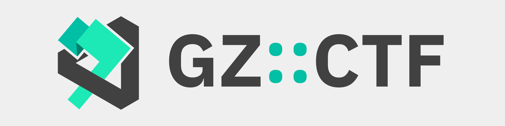
</picture>

# GZ::CTF

[English](./README.md), [简体中文](./README.zh.md), [日本語](./README.ja.md)

GZ::CTF 是一个基于 ASP.NET Core 的开源 CTF 平台。

> [!IMPORTANT]
> **为了避免不必要的时间浪费，使用前请详细阅读使用文档：[https://docs.ctf.gzti.me/zh](https://docs.ctf.gzti.me/zh)**

> [!WARNING]
> 2024/01/01 起，`develop` 镜像的数据库结构不再与之前的版本兼容，如果继续使用请转至 `v0.17`。
>
> 在新特性的快速开发期，不建议使用 `develop` 镜像进行生产部署，相关数据库结构变更将导致数据丢失。

## 特性 🛠️

- 创建高度可自定义的题目

  - 题目类型：静态附件、动态附件、静态容器、动态容器

    - 静态附件：共用附件，任意添加的 flag 均可提交。
    - 动态附件：需要至少满足队伍数量的 flag 和附件，附件及 flag 按照队伍进行分发。
    - 静态容器：共用容器模版，不下发 flag，任意添加的 flag 均可提交。
    - 动态容器：自动生成并通过容器环境变量进行 flag 下发，每个队伍 flag 唯一。

  - 动态分值

    - 分值曲线：

      $$f(S, r, d, x) = \left \lfloor S \times \left[r  + ( 1- r) \times \exp\left( \dfrac{1 - x}{d} \right) \right] \right \rfloor $$

      其中 $S$ 为原始分值、 $r$ 为最低分值比例、 $d$ 为难度系数、 $x$ 为提交次数。前三个参数可通过自定义实现绝大部分的动态分值需求。

    - 三血奖励：
      平台对一二三血分别奖励 5%、3%、1% 的当前题目分值

  - 比赛进行中可启用、禁用题目，可多次放题
  - 动态 flag 中启用作弊检测，可选的 flag 模版，leet flag 功能

- **分组队伍**得分时间线、分组积分榜
- 基于 **Docker 或 K8s** 的动态容器分发、管理、多种端口映射方式
- 基于 SignalR 的**实时**比赛通知、比赛事件和 flag 提交监控及日志监控
- SMTP 邮件验证功能、基于 Google ReCaptchav3 的恶意注册防护
- 用户封禁、用户三级权限管理
- 可选的队伍审核、邀请码、注册邮箱限制
- 平台内 Writeup 收集、查阅、批量下载
- 可下载导出积分榜、可下载全部提交记录
- 比赛期间裁判监控、提交和主要事件日志
- 题目流量 **TCP over WebSocket 代理转发**、可配置流量捕获
- 基于 Redis 的集群缓存、基于 PGSQL 的数据库存储后端
- 全局配置项自定义、平台标题、备案信息
- 支持测量和分布式追踪
- 以及更多……

## Demo 🗿

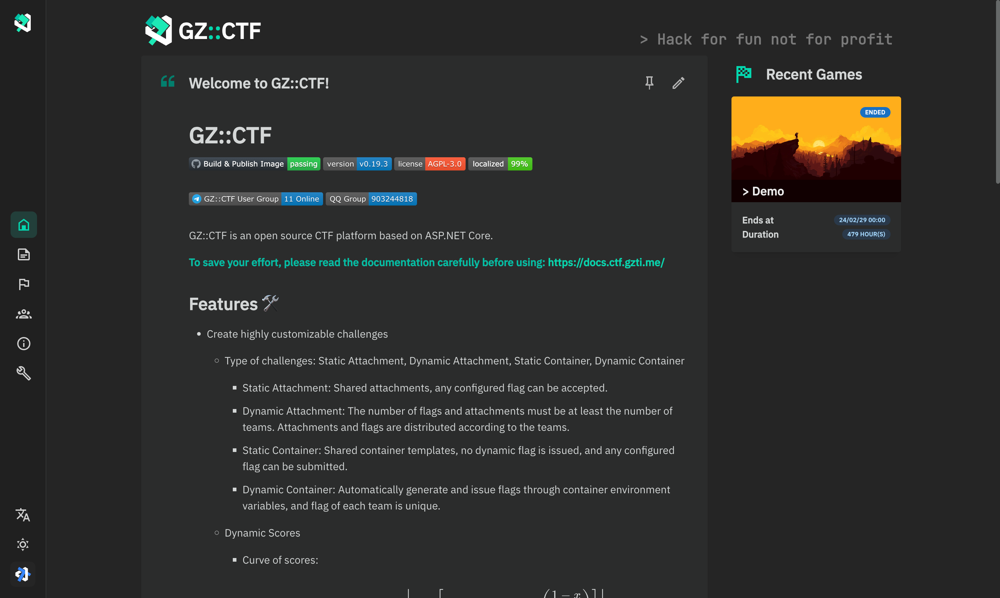
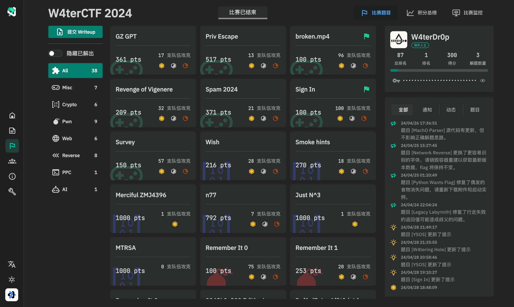
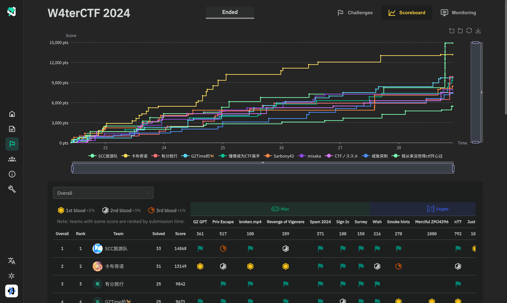
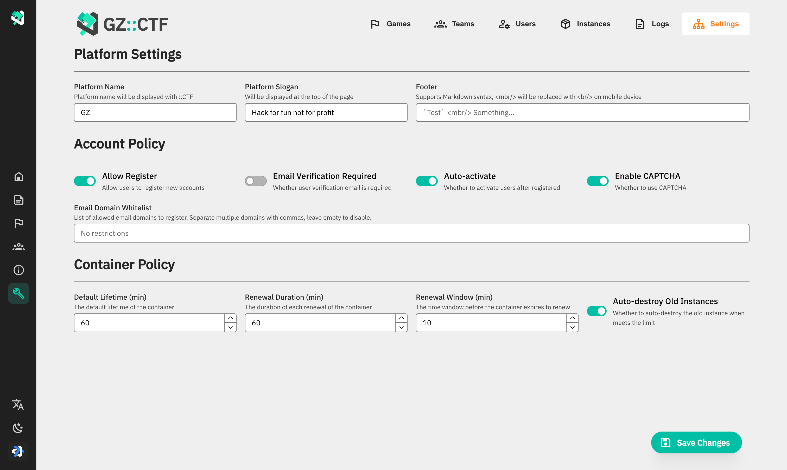
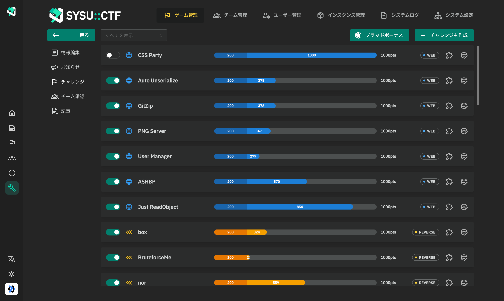
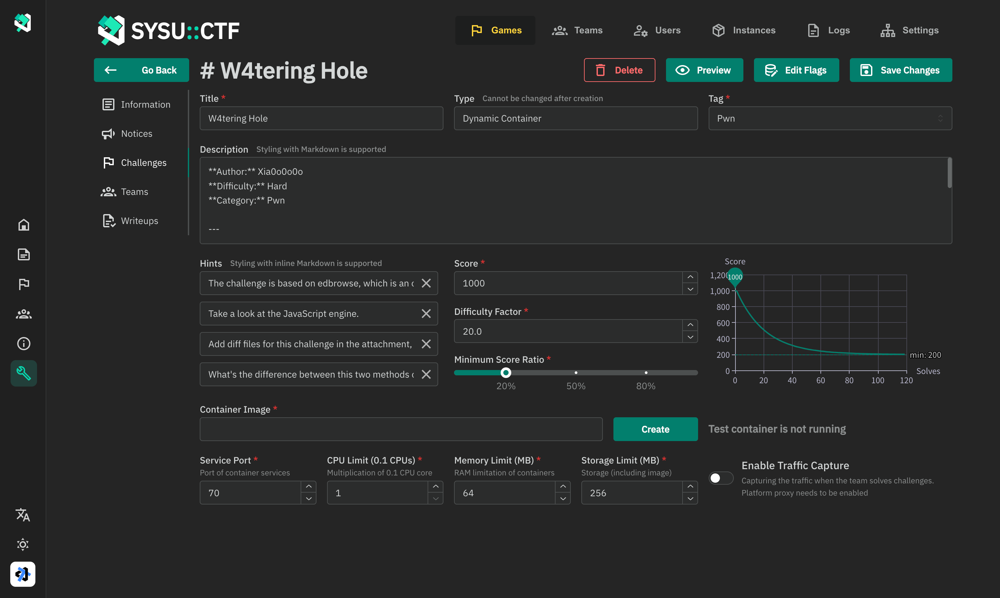
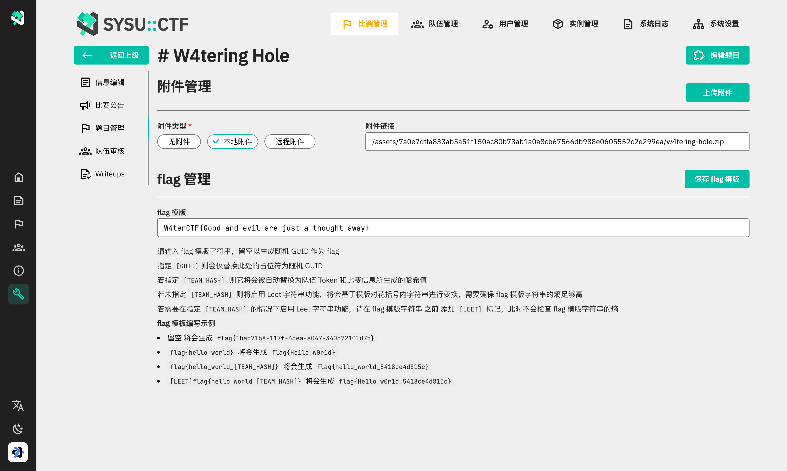
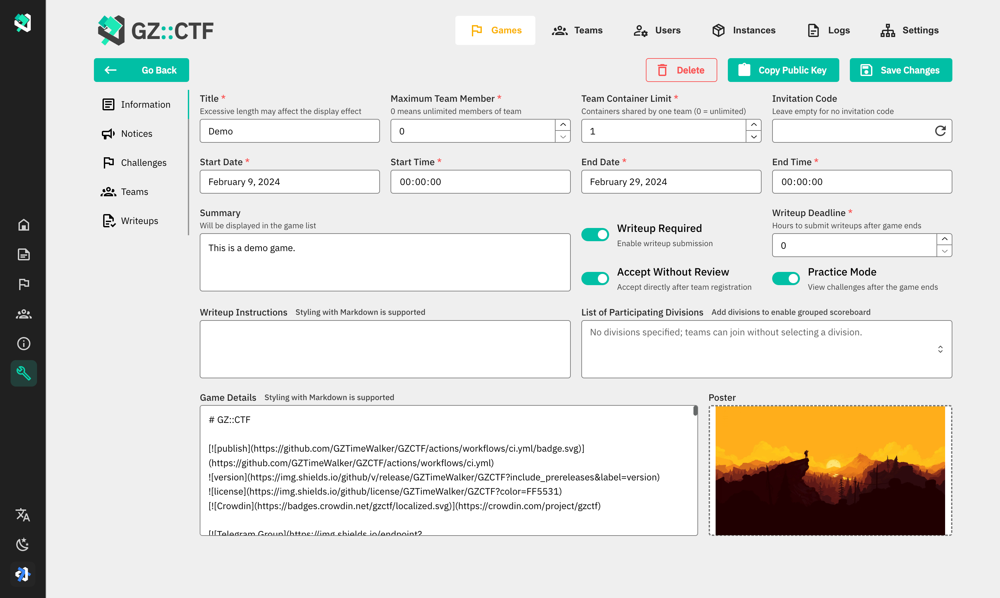
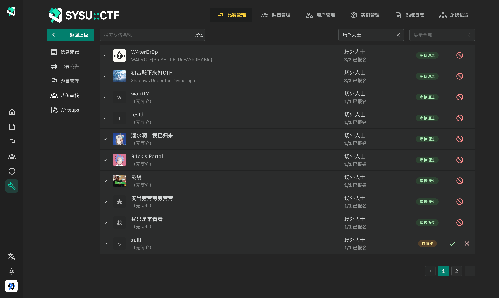
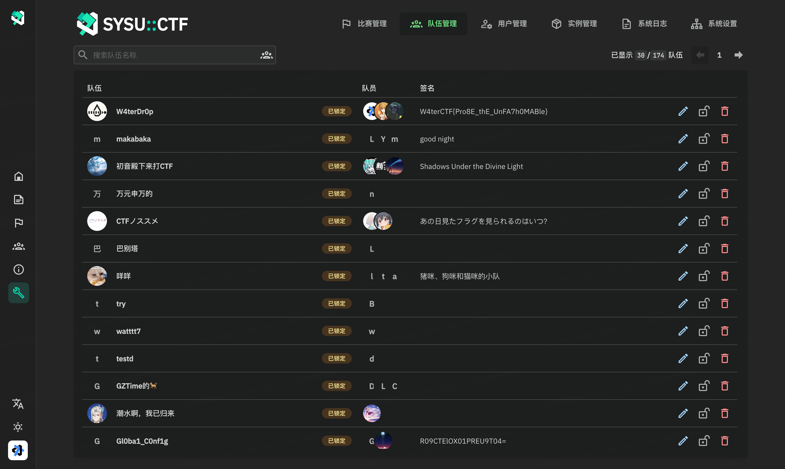
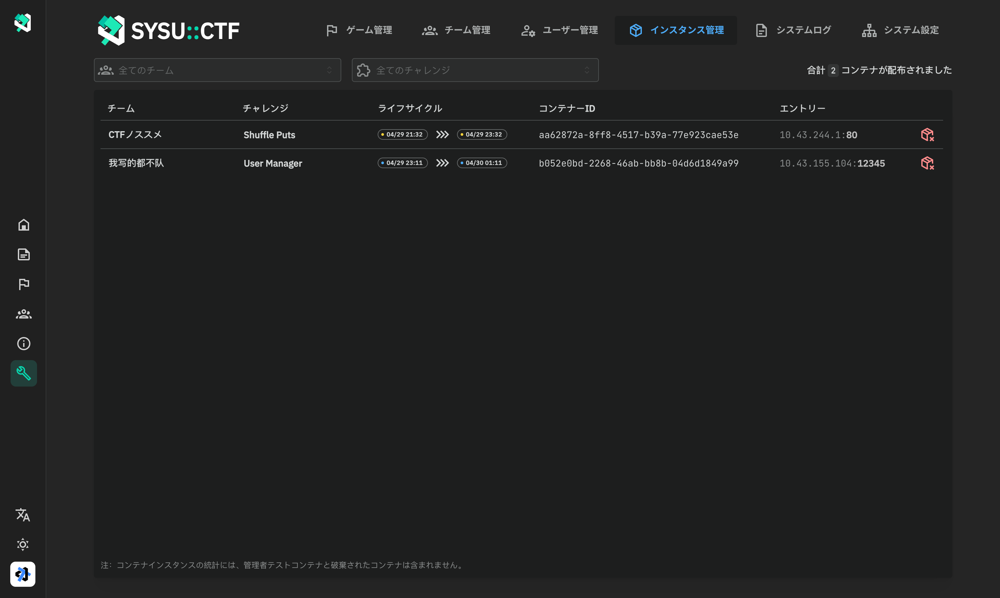
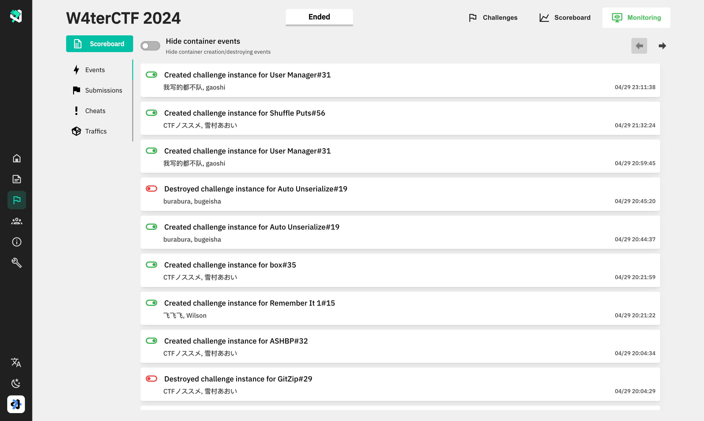
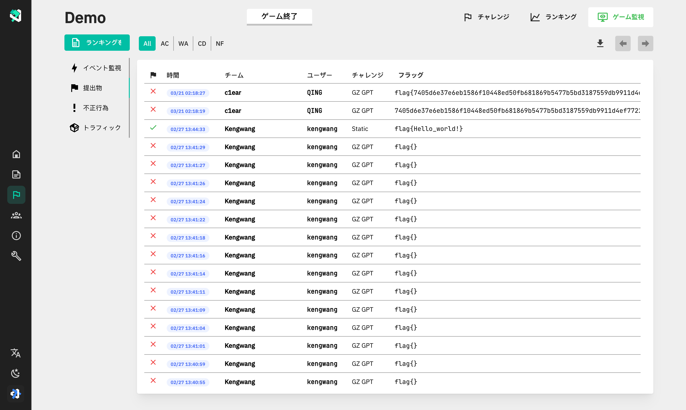

## 关于 i18n 🌐

目前多语言适配工作正在进行中，请在 [translate.ctf.gzti.me](https://translate.ctf.gzti.me) 中了解详情或参与翻译工作。

## 贡献者 👋

## 赛事案例 🏆

已经有一些赛事的举办者选择了 GZCTF 并圆满完赛，他们的信任、支持和及时的反馈是 GZCTF 不断完善的第一推动力。

- **清华大学网络安全技术挑战赛 THUCTF 2022**
- **浙江大学 ZJUCTF 2022/2023**
- **东南大学虎踞龙蟠杯网络安全挑战赛 SUSCTF 2022/2023**
- **甘肃政法大学 DIDCTF 2022/2023**
- **山东科技大学第一届网络安全实践大赛 woodpecker**
- **西北工业大学 NPUCTF 2022**
- **SkyNICO 网络空间安全三校联赛 (厦门理工学院、福建师范大学、齐鲁工业大学)**
- **湖南警察学院网络安全攻防大赛**
- **中山大学第一届信息安全新手赛 [W4terCTF 2023](https://github.com/W4terDr0p/W4terCTF-2023)**
- **同济大学第五届网络安全竞赛 TongjiCTF 2023**
- **重庆工商大学第一届网络安全竞赛 CTBUCTF 2023**
- **西北工业大学第一届安全实验技能竞赛 NPUCTF 2023**
- **浙江师范大学行知学院第一届网络安全新手赛 XZCTF 2023**
- **哈尔滨工程大学贡橙杯新生赛 ORGCTF 2023**
- **"山河"网络安全技能挑战赛 SHCTF 2023**
- **天津科技大学 2023 年大学生创客训练营网络安全组选拔**
- **湖南衡阳师范学院玄天网安实验室招新赛 HYNUCTF 2023**
- **南阳师范学院招新赛 NYNUCTF S4**
- **商丘师范学院首届网络安全新生挑战赛**
- **苏州市职业大学 2023 年冬季新生赛 [SVUCTF-WINTER-2023](https://github.com/SVUCTF/SVUCTF-WINTER-2023)**
- **北京经济管理职业学院 首届 BIEM“信安杯”CTF 竞赛**
- **北京航空航天大学 BUAACTF 2024**
- **加州大学圣迭戈分校 San Diego CTF 2024**
- **曲阜师范大学第一届“曲star”网络安全技能竞赛**

_排名不分先后，欢迎提交 PR 进行补充。_

## 特别感谢 ❤️‍🔥

感谢 THUCTF 2022 的组织者 NanoApe 提供的赞助及阿里云公网并发压力测试，帮助验证了 GZCTF 单机实例（16c90g）在千级并发、三分钟 134w 请求压力下的服务稳定性。

## Stars ✨

