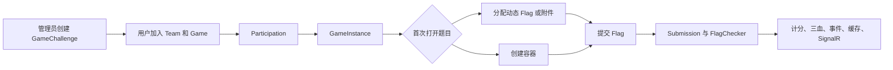
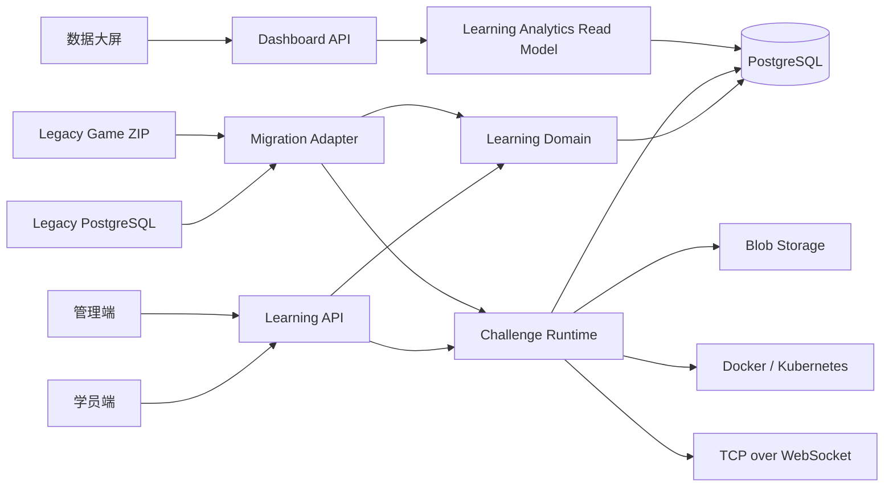
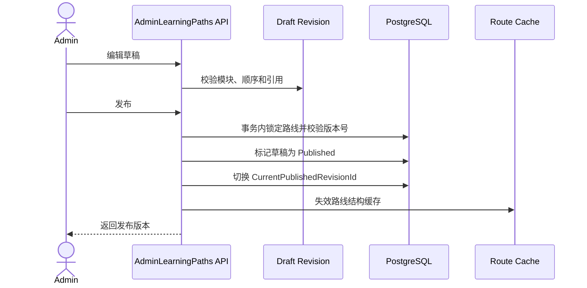
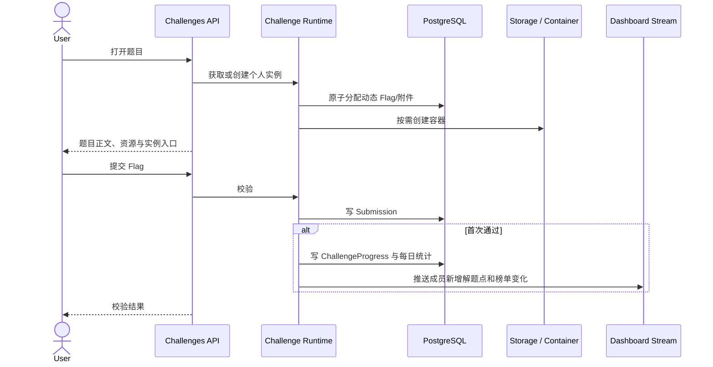

# GZCTF 学习靶场重构设计

> 2026-09-21 修订：技能树与全局共享类别的后续设计以
> `docs/superpowers/specs/2026-09-21-skill-tree-shared-categories-design.md`
> 为准。本文中的“学习路线 → 技能模块 → 内容项”结构仅描述首个已实现版本；两份文档冲突时，2026-09-21 规范优先。

- 日期：2026-09-19
- 状态：已审阅通过，进入实施计划阶段
- 目标分支：`develop`
- 设计范围：从比赛型 CTF 平台重构为学习路线驱动的个人练题平台

## 1. 执行摘要

本次重构将 GZCTF 从以比赛、队伍、计分和榜单为核心的系统，改造成以题库、学习路线、技能模块、图文课节和个人靶场进度为核心的学习平台。

重构采用新的 Learning 领域，不把 `Game` 重命名为路线，也不继续扩展当前未完成的 `Exercise` 实验代码。现有附件存储、四类题型、动态 Flag、Docker/Kubernetes 容器管理、TCP over WebSocket 代理、身份认证、限流、日志和遥测继续复用。

旧数据提供两种迁移入口：

1. 继续使用现有 PostgreSQL 数据卷时，应用启动自动执行增量迁移。
2. 管理员上传旧版比赛 ZIP，将题目导入统一题库。

原数据库中的用户账号和管理员权限保留；队伍、比赛成绩、提交历史和榜单不进入新学习模型，学习进度从零开始。每场旧比赛生成一条未发布的学习路线，并按旧题分类生成模块。旧题不会自动去重。

容器启动方式保持不变，包括 Dockerfile 入口、HTTP 8080、健康检查 3000、`GZCTF_` 环境变量、PostgreSQL、Redis、对象存储和容器提供器配置。

## 2. 已确认的产品决策

### 2.1 平台定位

- 新平台不提供比赛功能。
- 不兼容旧 `/api/game/*`、队伍和榜单 API。
- 旧比赛仅作为题目和路线迁移来源。
- 保留学员和管理员两类角色。
- 保留现有账号和管理员权限，移除 Monitor 在新领域中的业务含义。
- 迁移时 `Admin` 保持管理员，`User` 与 `Monitor` 映射为学员，`Banned` 保持禁用状态。

### 2.2 学习结构

- 固定三级结构：`学习路线 → 技能模块 → 内容项`。
- 内容项类型为 Markdown 图文课节或靶场题。
- 模块不支持继续嵌套。
- 模块和题目有推荐顺序，但不强制解锁；学员可自由进入任意模块和题目。
- 同一道题只保存一份，可被多个模块和路线引用。
- 同一道题解出一次后，所有引用它的路线同步计入完成状态。
- 学员可以加入多条路线，并设置一条当前学习路线。

### 2.3 访问规则

- 未登录访客可浏览路线、模块结构、难度和题目简介。
- 登录后才可阅读课节正文、下载附件、启动实例、提交 Flag 和保存进度。
- 学习中心展示路线简介、模块数、课时数、靶场题数和预计用时。
- 路线页面只显示单个内容项的完成标记，不显示聚合完成率。
- 路线进度、完成模块数和完成课时数仅在个人中心的学习记录页显示。

### 2.4 题目帮助

- 每道题支持有序提示和完整官方题解（WP）。
- 提示和 WP 随时可以查看。
- 查看提示或 WP 不会把题目标记为完成。
- 系统记录提示查看时间、首次打开 WP 时间以及首次解题时的帮助使用状态。
- 完成状态区分独立完成、使用提示后完成、查看 WP 后完成，仅用于个人学习记录和管理分析。

### 2.5 路线发布

- 已发布路线采用草稿修订机制。
- 管理员编辑草稿副本，点击发布后一次性切换当前版本。
- 学员始终读取一个完整的已发布修订。
- 已发布修订不可原地修改；后续变更只能通过新的草稿修订发布。
- 发布新修订会重新计算路线分母，但既有课节完成记录和题目完成记录不会丢失。

### 2.6 国际化

- 新页面首版维护简体中文和英语。
- 其他已有语言回退到英语。
- 导入旧内容时保留原文并设置默认语言；管理员可补充另一语言翻译。

### 2.7 大屏

- 大屏使用管理员生成的只读、可撤销令牌链接。
- 每名成员显示一条累计解题曲线。
- 曲线统计成员首次通过的不同靶场题数量；同题重复提交不增加计数。
- 可按管理员维护的标准年级筛选，可搜索用户名并高亮曲线。
- 大屏显示解题 Top 排行榜，公开字段仅包含平台用户名和已解题数。
- 默认 Top 10，可由管理员配置为 Top 20。
- 年级由管理员先创建标准选项，再单个或批量分配成员。
- 大屏通过 SignalR 接收新增解题点和榜单变化。

## 3. 当前代码库架构

### 3.1 后端

后端是 ASP.NET Core 10 单体应用，入口为 `src/GZCTF/Program.cs`。启动流程依次注册：

1. Web Host 和 Kestrel。
2. PostgreSQL 与 EF Core。
3. 本地磁盘或 S3 兼容存储。
4. 内存缓存或 Redis，并配置 SignalR backplane。
5. ASP.NET Core Identity。
6. OpenTelemetry、Prometheus 和健康检查。
7. Repository、容器管理、后台任务和 Controller。

`src/GZCTF/Extensions/Startup/ServicesExtension.cs` 集中注册服务。数据库模型集中在 `src/GZCTF/Models/AppDbContext.cs`。数据访问主要通过 `Repositories`，HTTP 入口位于 `Controllers`。

后台任务包括缓存构建、Flag 校验和定时清理。SignalR 目前服务于用户、裁判和管理员的比赛事件。

### 3.2 前端

前端位于 `src/GZCTF/ClientApp`，使用 React 19、Vite、Mantine、SWR 和文件路由。`src/GZCTF/ClientApp/src/Api.ts` 由 OpenAPI 生成。生产构建输出复制到 ASP.NET Core 的 `wwwroot`。

当前首页围绕比赛与公告，题目页面通过 `ChallengePanel`、`GameChallengeModal` 和实例组件组合。管理端题目编辑位于比赛子路由下。

### 3.3 数据与基础设施

- PostgreSQL 是必需依赖。
- Redis 可选，用于分布式缓存和 SignalR backplane。
- 存储支持本地磁盘、AWS S3、MinIO S3 和 Azure Blob。
- 容器支持 Docker Swarm 和 Kubernetes。
- 平台代理模式通过 TCP over WebSocket 暴露题目服务。
- 应用启动时自动执行 EF Core Migration。

### 3.4 当前比赛题数据流



### 3.5 当前 Exercise 状态

仓库已有 `ExerciseChallenge`、`ExerciseInstance`、依赖关系和两个 Repository，但 `ExerciseController` 为空，前端无入口，Repository 被明确排除测试覆盖。该代码属于未完成实验，不能作为生产功能直接延伸。

## 4. 审查发现与优先级

### P0：必须先处理

| 问题 | 证据 | 风险 | 处理方向 |
|---|---|---|---|
| 比赛领域贯穿题目运行 | `GameController`、`GameInstanceRepository`、`Participation` | 个人学习必须依赖队伍与比赛，路线无法复用题目 | 建立独立 Learning 和 Challenge Runtime 边界 |
| Exercise 是未完成实验 | `ExerciseController.cs:16`；两个 Repository 的 `ExcludeFromCodeCoverage` | 空 API、无前端、无行为保证 | 不继续堆功能；迁移可复用的数据定义，替换运行实现 |
| Exercise 解锁查询逻辑错误 | `ExerciseInstanceRepository.FetchNewChallenges` 中对全表使用 `All` | 存在其他用户实例或无关依赖时无法正确解锁 | 新模型不预建实例；使用明确的题目进度查询 |
| Exercise 动态附件未分配 | `GetInstance` 仅处理 `DynamicContainer` | 动态附件题无法获得个人 Flag/附件 | 抽取统一、原子化的 Flag/附件分配服务 |
| 数据库连接串可能泄露 | `DatabaseExtension.cs:38-41` 记录完整连接字符串 | 日志暴露数据库用户和密码 | 仅记录主机/数据库名或配置项名称，永不记录凭据 |

### P1：重构主线处理

| 问题 | 证据 | 风险 | 处理方向 |
|---|---|---|---|
| 比赛与练习重复实现 | `GameChallenge/ExerciseChallenge`、`GameInstance/ExerciseInstance` | 修复与功能演进容易只落到一边 | 使用单一 `Challenge` 和 `UserChallengeInstance` |
| Controller 过大 | `GameController` 约 1455 行，`EditController` 约 1101 行 | 权限、查询、业务和文件处理混杂 | 按路线、题库、实例、提交、导入拆 Controller 与应用服务 |
| 隐式加载成本 | `AppDbContext` 广泛 `AutoInclude` | 列表查询隐式加载用户、队伍、附件和题目，SQL 次数不可见 | 新领域禁用 AutoInclude，使用投影和显式 Include |
| 用户实例批量预生成 | `ExerciseInstanceRepository.GetExerciseInstances` | 数据量接近用户数乘题目数 | 首次访问时按需创建实例 |
| 导入服务直接创建比赛实体 | `GameImportService` | ZIP 导入无法直接复用到题库 | 建立稳定的 Canonical Challenge Import 模型 |
| 分类使用固定枚举 | `ChallengeCategory` | 无法表达“基础知识、逻辑漏洞、OWASP Top 10”等可编辑模块 | 模块使用数据库实体；旧分类只作为迁移信息和题目标签 |
| 路线完成与题目完成可能重复存储 | 现有模型无路线复用 | 题目跨路线后容易产生不一致 | 题目完成全局唯一，路线进度按引用实时/缓存聚合 |
| 动态附件分配存在并发风险 | 旧实现读取未占用列表后随机选择 | 并发请求可能领取同一附件 | 数据库行锁或原子更新，并添加唯一约束与并发测试 |

### P2：维护性改进

| 问题 | 证据 | 处理方向 |
|---|---|---|
| 大型前端页面 | 题目编辑页约 626 行，多处页面超过 500 行 | 按表单区块、运行配置、帮助内容和预览拆组件 |
| Repository 基类契约不完整 | `RepositoryBase.CountAsync` 抛 `NotImplementedException` | 删除无意义基类接口或实现明确的查询接口 |
| 项目说明陈旧 | `.github/copilot-instructions.md` 仍描述 ASP.NET Core 9，项目已为 net10.0 | 与实现同步更新开发文档 |
| 生成 API 文件过大 | `Api.ts` 约 5768 行 | 继续自动生成，不手工维护；按 OpenAPI tag 分模块输出 |

## 5. 目标架构

### 5.1 总体边界



### 5.2 代码组织

新增功能按领域组织，逐步替换当前按技术层平铺的结构：

```text
src/GZCTF/Features/
  LearningPaths/
    Domain/
    Application/
    Api/
    Infrastructure/
  ChallengeLibrary/
    Domain/
    Application/
    Api/
    Infrastructure/
  ChallengeRuntime/
    Domain/
    Application/
    Api/
    Infrastructure/
  LearningProgress/
  Imports/
  Dashboard/
```

现有 Storage、Container Manager、Identity、Telemetry 和通用中间件继续保留在共享基础设施层。领域代码依赖接口，不直接依赖 Docker、Kubernetes 或 S3 实现。

### 5.3 核心实体

#### 题库与运行

| 实体 | 作用 | 关键约束 |
|---|---|---|
| `Challenge` | 唯一题目与运行配置 | 题型创建后不可直接切换；支持草稿、发布、停用 |
| `ChallengeLocalization` | 中英文标题、简介和正文 | `(ChallengeId, Locale)` 唯一 |
| `ChallengeHint` | 有序提示 | 绑定题目和顺序；内容可本地化 |
| `ChallengeWriteup` | 官方 WP | 每题每语言最多一份 |
| `ChallengeFlag` | 静态 Flag、动态附件 Flag 或模板配置 | Flag 不出现在普通查询 DTO |
| `UserChallengeInstance` | 用户题目实例 | `(UserId, ChallengeId)` 最多一个活动实例 |
| `ChallengeSubmission` | 用户提交记录 | 保存状态、时间和题目引用 |
| `ChallengeProgress` | 首次通过记录 | `(UserId, ChallengeId)` 唯一 |
| `ChallengeHelpUsage` | 提示与 WP 查看记录 | 用于计算完成时的帮助状态 |

`Challenge` 保留四类题型：

- 静态附件
- 动态附件
- 静态容器
- 动态容器

比赛专用字段如动态计分、三血、比赛截止时间和队伍提交限制不进入新运行模型。旧值保存在迁移元数据中用于审计，不影响学习题运行。

#### 学习路线

| 实体 | 作用 | 关键约束 |
|---|---|---|
| `LearningPath` | 路线稳定身份、Slug、当前版本 | Slug 唯一 |
| `LearningPathLocalization` | 路线中英文标题与简介 | `(PathId, Locale)` 唯一 |
| `LearningPathRevision` | 路线草稿或已发布快照 | 同一路线仅一个当前草稿和一个当前发布版本 |
| `LearningModule` | 修订内的技能模块 | `(RevisionId, SortOrder)` 有索引 |
| `LearningModuleLocalization` | 模块中英文名称与说明 | `(ModuleId, Locale)` 唯一 |
| `ModuleItem` | 模块对 Lesson 或 Challenge 的有序引用 | 必须且只能引用一种内容类型 |
| `Lesson` | Markdown 图文课节 | 独立稳定身份 |
| `LessonLocalization` | 课节中英文内容 | `(LessonId, Locale)` 唯一 |
| `Enrollment` | 用户加入路线及当前路线状态 | `(UserId, PathId)` 唯一；每用户最多一个 Current |
| `LessonProgress` | 用户完成课节 | `(UserId, LessonId)` 唯一 |

课时定义：一个 Markdown 课节或一道靶场题均计为一个课时。

#### 年级与大屏

| 实体 | 作用 | 关键约束 |
|---|---|---|
| `Cohort` | 管理员维护的年级 | 名称唯一，可停用 |
| `UserInfo.CohortId` | 成员所属年级 | 单选，可为空 |
| `Dashboard` | 大屏名称、Top 数量和显示设置 | 管理员管理 |
| `DashboardToken` | 只读访问令牌 | 数据库存哈希，可撤销和过期 |
| `LearnerDailySolveStat` | 每成员每日首次解题数量 | `(UserId, Date)` 唯一 |

`ChallengeProgress` 是真实来源。每日统计是可重建的读取模型，用于大屏性能，不反向决定个人完成状态。

#### 迁移

| 实体 | 作用 |
|---|---|
| `MigrationBatch` | 记录来源、包指纹、状态、数量、警告、错误与完成时间 |
| `LegacyChallengeMap` | 映射旧来源类型、旧 ID 和新 Challenge ID，保证幂等 |
| `LegacyPathMap` | 映射旧 Game 与新草稿路线 |

### 5.4 路线发布数据流



### 5.5 做题数据流



## 6. API 与页面设计

### 6.1 API 边界

#### 公开

- `GET /api/learning-paths`
- `GET /api/learning-paths/{slug}/preview`

只返回路线摘要、模块名、内容标题、模块数、课时数、靶场题数和预计用时，不返回课节正文或题目正文。

#### 学员

- Enrollment：加入、退出、设置当前路线。
- MyLearning：当前路线、已加入路线和个人学习记录。
- Lessons：读取正文、标记完成。
- Challenges：读取题目、附件信息、提示和 WP。
- ChallengeInstances：启动、延长、销毁和查询实例。
- Submissions：提交 Flag 和读取自己的近期提交。
- HelpUsage：查看提示和 WP 时写入使用记录。

#### 管理员

- AdminChallenges：题库、Flag、附件、容器配置、提示、WP、来源和合并。
- AdminLessons：中英文 Markdown 课节。
- AdminLearningPaths：路线基本信息、修订、模块、内容排序、预览和发布。
- AdminCohorts：年级维护与成员批量分配。
- Imports：数据库迁移报告与旧 ZIP 导入。
- Dashboards：大屏配置、令牌生成、撤销和轮换。

#### 大屏

- `GET /api/dashboards/{id}/snapshot?token=...`
- `GET /hub/dashboard?token=...`

大屏 DTO 仅包含用户名、年级筛选项、累计曲线点、Top 排名和更新时间。

### 6.2 学员页面

| 路由 | 页面 |
|---|---|
| `/learn` | 路线发现、当前路线、已加入路线 |
| `/learn/{slug}` | 路线目录与模块介绍，不显示聚合进度 |
| `/learn/{slug}/{module}/{item}` | 连续学习工作区 |
| `/challenges/{id}` | 独立题目工作区，可由路线跳转 |
| `/account/learning` | 路线进度、完成模块、完成课时、最近学习记录 |

题目工作区同屏提供：

- 题目正文和附件。
- 容器入口、剩余时间、启动/延长/销毁操作。
- Flag 输入与提交反馈。
- 有序提示。
- 完整官方 WP。
- 上一个/下一个内容项导航。

### 6.3 管理员页面

| 路由 | 页面 |
|---|---|
| `/admin/library/challenges` | 题库列表、筛选、来源和合并 |
| `/admin/library/challenges/{id}` | 题目、运行配置、Flag、附件、提示、WP |
| `/admin/library/lessons` | 课节列表与中英文编辑 |
| `/admin/learning-paths` | 路线列表和发布状态 |
| `/admin/learning-paths/{id}` | 草稿编排、模块和内容排序、预览、发布 |
| `/admin/imports` | ZIP 导入与迁移报告 |
| `/admin/cohorts` | 年级与成员分配 |
| `/admin/dashboards` | 大屏和访问令牌 |

## 7. 迁移设计

### 7.1 原数据库增量迁移

首个重构版本执行以下步骤：

1. EF Core Migration 创建新题库、学习路线、进度、年级、大屏和迁移记录表。
2. 应用在开始接收请求前运行可恢复、幂等的旧数据回填批次；该批次失败时启动健康状态为失败，不开放业务流量。
3. 为每个旧 `GameChallenge` 创建独立 `Challenge`。
4. 复制标题、正文、原分类、题型、Hints、Flag、Flag 模板、附件引用、文件名、容器镜像、端口、CPU、内存、存储和网络模式。
5. 旧 Hints 转为有序 `ChallengeHint`。
6. 官方 WP 保持为空，并在迁移报告中标记待补充。
7. 为每个 Game 创建一条草稿路线。
8. 按旧 `ChallengeCategory` 创建模块，题目按旧 ID 排序。
9. 保存来源比赛 ID、比赛名和旧题 ID。
10. 保留旧用户账号；`Admin` 保持管理员，`User` 与 `Monitor` 映射为学员，`Banned` 保持禁用。
11. 不创建旧队伍、比赛成绩、提交或榜单对应的新记录。
12. 不删除旧表。

旧 `GameChallenge.Difficulty` 是动态计分系数，不是学习难度。迁移后题目学习难度默认 `Normal`，旧值进入迁移元数据，报告提示管理员审核。

旧 `ExerciseChallenge` 如存在数据，也迁移到统一题库，并生成一条“Legacy Exercises”草稿路线；依赖关系仅用于推荐排序，不转为强制解锁。

### 7.2 ZIP 导入

ZIP 导入继续兼容现有 Manifest、TransferGame 和 TransferChallenge 格式：

1. 校验包大小、路径安全、Manifest 版本和文件哈希。
2. 将 Transfer 模型映射为 `CanonicalChallengeImport`。
3. 附件先写入临时区并验证。
4. 在一个导入批次中创建题目、Flag、附件引用、草稿路线和模块。
5. 数据库提交成功后确认 Blob；失败时回滚数据库并清理本次新增 Blob。

### 7.3 幂等与重复题

- 数据库迁移使用来源类型和旧 ID 建立唯一映射。
- ZIP 导入使用包指纹和包内旧 ID 建立唯一映射。
- 重复启动或重复上传返回已有批次结果，不重复创建数据。
- 标题、正文、附件或容器配置相似的题目不会自动合并。
- 管理员后续手工合并题目时，系统重定向路线引用和完成记录，并保留审计映射。

### 7.4 完整性报告

每个批次记录：

- 来源和指纹。
- Game 数、题目数、模块数。
- 四类题型数量。
- Flag 数和附件数。
- 附件哈希校验结果。
- 容器配置数量。
- 缺失文件、不支持字段和默认值。
- 旧 ID 到新 ID 映射。
- 批次开始、完成和失败时间。

## 8. 错误处理与安全

### 8.1 API 错误

新 API 返回统一错误结构：

- 稳定错误码。
- 本地化消息。
- HTTP 状态码。
- 关联 ID。
- 可选字段级校验错误。

前端按错误码处理已存在、并发冲突、资源不足、容器失败和导入失败，不解析日志文本。

### 8.2 并发

- 路线发布通过并发版本号和数据库事务防止覆盖。
- 动态附件通过原子领取或行锁保证一个附件只分配给一个活动用户实例。
- 用户容器通过唯一约束和幂等命令防止重复创建。
- `ChallengeProgress(UserId, ChallengeId)` 唯一，保证重复正确提交只完成一次。
- `Enrollment` 通过部分唯一索引或事务保证每用户最多一个当前路线。

### 8.3 凭据与隐私

- 数据库连接串不写日志。
- Flag、访问令牌和密码不写结构化日志属性。
- 大屏令牌仅存哈希，可过期、撤销和轮换。
- 大屏只返回用户名，不返回真实姓名、学号、邮箱、IP 或提交内容。
- 大屏令牌应用独立限流。

## 9. 性能设计

### 9.1 查询原则

- 新领域不使用导航属性的全局 `AutoInclude`。
- 列表使用 DTO 投影和 `AsNoTracking`。
- Markdown 正文、Flag、附件和容器详情不进入列表响应。
- 路线结构和个人进度分开查询，在应用层合并。
- 个人实例按首次访问创建。

### 9.2 缓存

- 已发布路线结构可缓存，因为只在发布时变化。
- 个人进度采用短时缓存或不缓存，以真实记录为准。
- 大屏快照采用短时缓存，首次解题、年级变更和大屏配置变更时精确失效。
- SignalR 只推送新增解题点和榜单变化，不重复推送完整历史。

### 9.3 大屏数据量

- `LearnerDailySolveStat` 保存每名成员每日首次解题数量。
- API 将每日增量转换为累计序列。
- 长时间范围降采样为周粒度，单成员最多返回约 120 个点。
- 前端使用 ECharts Canvas；全部曲线低透明度绘制，搜索或悬停时高亮一条。

### 9.4 关键索引

- `LearningPath.Slug`
- `LearningPathRevision(PathId, Status)`
- `LearningModule(RevisionId, SortOrder)`
- `ModuleItem(ModuleId, SortOrder)`
- `Enrollment(UserId, PathId)`
- `LessonProgress(UserId, LessonId)`
- `ChallengeProgress(UserId, ChallengeId)`
- `ChallengeProgress(SolvedAtUtc)`
- `UserChallengeInstance(UserId, ChallengeId)`
- `UserInfo.CohortId`
- `LearnerDailySolveStat(UserId, Date)`
- `DashboardToken.TokenHash`
- 迁移来源映射的唯一复合索引

## 10. 运维与部署

### 10.1 保持不变

- Dockerfile 入口：`dotnet GZCTF.dll`
- 应用端口：8080
- 健康检查与指标端口：3000
- 环境变量前缀：`GZCTF_`
- PostgreSQL 连接配置
- Redis 可选配置
- 本地磁盘和对象存储配置
- Docker Swarm/Kubernetes 容器提供器配置
- 自动 EF Core Migration

### 10.2 健康检查

健康状态覆盖：

- PostgreSQL 可连接。
- Blob 存储可读写。
- 容器提供器可用。
- 数据库不存在运行中或失败后未处理的启动迁移。

大屏统计或 SignalR 故障降级为缓存快照，不影响课节和做题 API。

### 10.3 旧表清理

首个重构版本保留旧比赛表。确认生产迁移报告、题目运行和附件完整性后，再单独设计清理迁移。清理不与首次上线绑定。

## 11. 重构计划

### 阶段 0：建立行为基线

1. 修复数据库连接串日志泄露。
2. 为四类旧题建立特征测试。
3. 固化旧 ZIP 金样包和旧数据库样本。
4. 记录题目、Flag、附件和容器配置导出清单。
5. 在 .NET SDK 容器中跑通现有单元与集成测试。

验收：现有题目能力可被自动化测试描述，后续差异有明确基线。

### 阶段 1：新领域骨架

1. 新增 Challenge Library、Learning Paths、Progress、Cohort、Dashboard 和 Import 表。
2. 配置索引、唯一约束和并发令牌。
3. 建立应用服务接口和小型 Controller。
4. 新增 OpenAPI 类型并按 tag 模块化生成前端客户端。

验收：空数据库可创建管理员、题目、课节、草稿路线并发布。

### 阶段 2：统一题目运行时

1. 从 `GameInstanceRepository` 和 `ExerciseInstanceRepository` 提取 Flag、附件、容器生命周期能力。
2. 实现用户级实例。
3. 实现四类题型。
4. 实现提示、WP 和帮助使用记录。
5. 实现首次通过与全局题目完成。

验收：四类题型的端到端行为通过，实例和动态附件并发安全。

### 阶段 3：迁移与导入

1. 实现 Canonical Challenge Import。
2. 实现原数据库增量迁移和来源映射。
3. 改造旧 ZIP 导入。
4. 生成草稿路线、分类模块和完整性报告。
5. 实现重复批次幂等和失败回滚。

验收：固定旧数据库和 ZIP 的迁移差异报告中，题目内容、附件哈希、Flag 和容器配置差异为零。

### 阶段 4：学习端

1. 路线发现和预览。
2. 加入多条路线和设置当前路线。
3. 路线目录和连续学习工作区。
4. 题目工作区、提示与 WP。
5. 个人中心学习记录。

验收：访客、学员和管理员权限边界正确；路线页面不显示聚合进度，个人中心显示完整统计。

### 阶段 5：管理端

1. 统一题库。
2. 课节编辑。
3. 路线草稿编排、预览和发布。
4. 导入报告。
5. 年级与成员批量分配。

验收：管理员无需直接操作数据库即可完成全部内容维护与迁移审核。

### 阶段 6：大屏

1. 每日成员解题读取模型。
2. 年级筛选和用户名搜索。
3. 每成员累计曲线和 Top 排行榜。
4. 只读令牌和 SignalR 更新。

验收：重复提交不重复计数；所有成员曲线、年级筛选和榜单与源数据一致。

### 阶段 7：移除比赛运行入口

1. 删除比赛、队伍、计分、三血、裁判和比赛监控页面。
2. 删除旧 API 路由和无用 SignalR 客户端事件。
3. 移除旧 Repository 与服务注册。
4. 保留旧表和迁移映射，暂不执行物理清理。

验收：生产构建不包含比赛导航和可调用比赛 API，旧数据仍可通过迁移报告核对。

## 12. 测试与行为证明

“行为未改变”指旧题迁移后的内容、附件、Flag、容器配置和四类题型作答能力保持一致。比赛、队伍、计分、榜单和旧 API 属于明确删除的行为。

### 12.1 测试矩阵

| 测试 | 证明内容 |
|---|---|
| 旧数据库迁移特征测试 | 四类题型、Flag、附件、容器和提示逐字段保持 |
| 重复启动迁移 | 不重复创建题目、Flag、附件或路线 |
| ZIP 金样导入 | 包内题目数、附件哈希、Flag 和配置保持 |
| ZIP 安全与回滚 | 路径穿越、哈希错误、缺失附件和数据库异常安全失败 |
| 静态附件端到端 | 打开、下载、错误提交、正确提交和完成 |
| 动态附件端到端 | 原子领取个人附件和 Flag，提交正确 |
| 静态容器端到端 | 复用全局 Flag，用户实例生命周期正确 |
| 动态容器端到端 | 每用户动态 Flag、容器环境变量和提交正确 |
| 容器契约测试 | 镜像、端口、CPU、内存、存储和网络模式保持 |
| 并发测试 | 重复启动只有一个实例，多用户不领取同一动态附件 |
| 跨路线题目 | 解出一次后所有引用同步完成 |
| 路线发布 | 草稿原子切换，旧完成记录保留 |
| 提示与 WP | 查看不完成题目，帮助使用状态正确 |
| 权限 | 访客、学员、管理员和大屏令牌权限正确 |
| 年级与大屏 | 成员曲线、筛选、搜索、Top 和并列排序正确 |
| 前端关键流程 | 路线、课节、题目、实例、Flag、个人记录、管理发布和大屏 |
| 性能回归 | 路线详情、题目打开和大屏无 N+1 与无界响应 |

### 12.2 发布门槛

1. 后端单元和集成测试全部通过。
2. 前端 TypeScript、lint 和生产构建通过。
3. 四类题型端到端测试全部通过。
4. 旧数据库连续执行两次迁移后结果一致。
5. 固定 ZIP 导入报告无未解释的数据丢失。
6. Docker 入口、端口和环境变量契约测试通过。
7. 迁移前后题目差异报告中，附件哈希、Flag 和容器配置差异为零。
8. 首个版本不删除旧比赛表。

### 12.3 当前基线

- 前端 `pnpm check` 已通过。
- 当前主机未安装 .NET SDK，尚未在本机直接执行后端测试。
- Docker 可用；实现阶段使用 .NET SDK 10 容器建立后端测试基线。
- 系统 `git` 被未接受的 Xcode 许可阻断，已使用 Codex Runtime 自带 Git 完成仓库读取。

## 13. 风险与缓解

| 风险 | 缓解措施 |
|---|---|
| 大数据库启动迁移时间过长 | 分批回填、记录批次进度、先在数据库副本测量；DDL 保持增量 |
| 附件引用计数不一致 | 迁移前后按 Blob hash 对账；新引用与 Blob 提交同事务/补偿清理 |
| 动态附件数量不足 | 导入报告提示可用数量；领取失败返回明确资源不足错误 |
| 容器迁移后残留旧实例 | 上线前运行旧实例清理任务，新运行时不复用旧 GameInstance |
| 路线新版本改变完成率 | 个人中心按当前发布版本重算，历史完成记录保持不变 |
| 全成员曲线数据量过大 | 每日读取模型、最多约 120 点、Canvas 渲染和增量推送 |
| 两套领域长期共存 | 明确阶段 7 删除旧运行入口；旧表仅作迁移核对，不继续写入 |
| 旧内容语言不明确 | 导入保留原文和默认语言，报告列出缺失的另一语言版本 |

## 14. 完成定义

满足以下条件后，本次重构视为完成：

- 新平台没有比赛、队伍、计分、三血、榜单和裁判入口。
- 管理员可维护题库、课节、路线草稿、发布版本、年级、导入和大屏。
- 学员可选择多条路线、学习 Markdown 课节、完成四类靶场题并在题目页查看提示和 WP。
- 个人中心显示学习进度；路线页面不显示聚合进度。
- 同一道题可跨路线复用，完成状态全局共享。
- 旧数据库与旧比赛 ZIP 可幂等迁移，题目关键字段无损。
- 原账号和管理员权限保留，学习进度从零开始。
- 大屏显示所有成员累计解题曲线、年级筛选、搜索和 Top 排行榜。
- 容器启动方式、端口和环境配置不改变。
- 测试矩阵和发布门槛全部通过。
